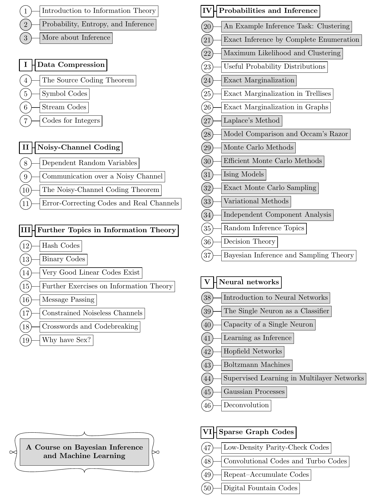

<!-- PDF 物理页 10；原书印刷页 x。整页正文为一幅课程路线图；下图仅裁取图本身。 -->

**图内文字译注：**底部标题为“贝叶斯推断与机器学习课程”；灰底方框表示这条课程路线选用的章节。图中各方框的译文如下，编号与位置沿用原图。

**本路线选用的灰底章节（按原图两列的章号列出）：**

- 开篇：2 概率、熵与推断；3 进一步讨论推断。
- IV 概率与推断：20 一个推断任务示例：聚类；21 通过完全枚举进行精确推断；22 最大似然与聚类；24 精确边缘化；27 拉普拉斯方法；28 模型比较与奥卡姆剃刀；29 蒙特卡罗方法；30 高效蒙特卡罗方法；31 Ising 模型；32 精确蒙特卡罗采样；33 变分方法；34 独立成分分析。
- V 神经网络：38 神经网络导论；39 作为分类器的单个神经元；40 单个神经元的容量；41 将学习视为推断；42 Hopfield 网络；43 玻尔兹曼机；44 多层网络中的监督学习；45 高斯过程。

**图中全部章节方框的译文：**

- 1 信息论导论；2 概率、熵与推断；3 进一步讨论推断。
- I 数据压缩：4 信源编码定理；5 符号编码；6 流编码；7 整数编码。
- II 有噪信道编码：8 相依随机变量；9 有噪信道上的通信；10 有噪信道编码定理；11 纠错码与实值信道。
- III 信息论专题：12 哈希码；13 二元码；14 存在非常好的线性码；15 信息论补充习题；16 消息传递；17 受约束的无噪信道；18 填字游戏与密码破解；19 为什么要有性？
- IV 概率与推断：20 一个推断任务示例：聚类；21 通过完全枚举进行精确推断；22 最大似然与聚类；23 常用的概率分布；24 精确边缘化；25 格形图中的精确边缘化；26 图中的精确边缘化；27 拉普拉斯方法；28 模型比较与奥卡姆剃刀；29 蒙特卡罗方法；30 高效蒙特卡罗方法；31 Ising 模型；32 精确蒙特卡罗采样；33 变分方法；34 独立成分分析；35 若干推断专题；36 决策理论；37 贝叶斯推断与抽样理论。
- V 神经网络：38 神经网络导论；39 作为分类器的单个神经元；40 单个神经元的容量；41 将学习视为推断；42 Hopfield 网络；43 玻尔兹曼机；44 多层网络中的监督学习；45 高斯过程；46 去卷积。
- VI 稀疏图码：47 低密度奇偶校验码；48 卷积码与 Turbo 码；49 重复—累积码；50 数字喷泉码。
