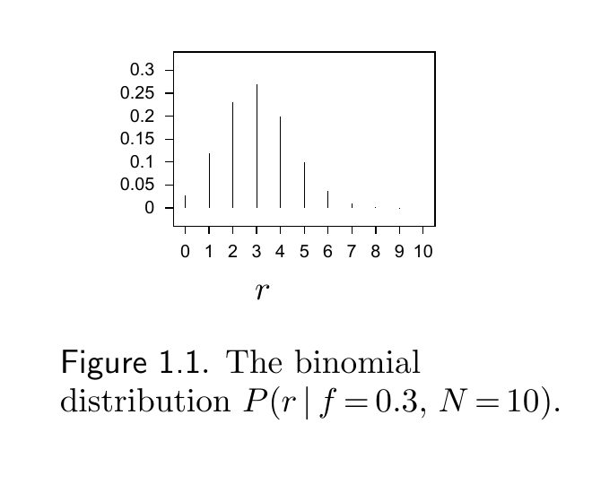

<!-- PDF 物理页 13；原书印刷页 1。原书将“About Chapter 1”置于第 1 章章题之前，作为独立的预备知识；第 1 章章题从 PDF 物理页 15 开始。 -->

# 关于第 1 章

阅读第一章，需要熟悉二项分布。要解答书中的习题——我强烈建议你亲自动手——还需要知道用于阶乘函数的斯特林近似 $x!\simeq x^x e^{-x}$，并能够把它用于二项式系数 $\binom Nr=\dfrac{N!}{(N-r)!r!}$。下面回顾这些内容。

**页边提示：**遇到不熟悉的符号？请参见第 598 页的附录 A。

## 二项分布

**例 1.1。**一枚有偏的硬币掷出正面的概率为 $f$。将它抛掷 $N$ 次。正面出现次数 $r$ 的概率分布是什么？$r$ 的均值和方差各是多少？

**解。**正面出现次数服从二项分布：

$$P(r\mid f,N)=\binom Nr f^r(1-f)^{N-r}.\tag{1.1}$$

**图 1.1。**二项分布 $P(r\mid f=0.3,N=10)$。图内横轴 $r$ 表示正面出现次数，纵轴表示相应概率。

这个分布的均值 $\mathcal{E}[r]$ 和方差 $\operatorname{var}[r]$ 定义为：

$$\mathcal{E}[r]\equiv\sum_{r=0}^{N}P(r\mid f,N)\,r.\tag{1.2}$$

$$\operatorname{var}[r]\equiv\mathcal{E}\!\left[(r-\mathcal{E}[r])^2\right],\tag{1.3}$$

$$\phantom{\operatorname{var}[r]}=\mathcal{E}[r^2]-(\mathcal{E}[r])^2=\sum_{r=0}^{N}P(r\mid f,N)r^2-(\mathcal{E}[r])^2.\tag{1.4}$$

不必直接计算式 (1.2) 和式 (1.4) 中对 $r$ 的求和。更简便的办法是注意到，$r$ 是 $N$ 个独立随机变量之和：第一次抛掷的正面次数（只能是 0 或 1）、第二次抛掷的正面次数，依此类推。一般地，

$$\begin{aligned}\mathcal{E}[x+y]&=\mathcal{E}[x]+\mathcal{E}[y] &&\text{对任意随机变量 }x,y;\\ \operatorname{var}[x+y]&=\operatorname{var}[x]+\operatorname{var}[y]&&\text{若 }x,y\text{ 独立。}\end{aligned}\tag{1.5}$$

因此，$r$ 的均值等于这些随机变量的均值之和，$r$ 的方差等于它们的方差之和。单次抛掷得到正面的平均次数为 $f\times1+(1-f)\times0=f$；单次抛掷得到正面次数的方差为：

$$\left[f\times1^2+(1-f)\times0^2\right]-f^2=f-f^2=f(1-f).\tag{1.6}$$

所以，$r$ 的均值和方差是：

$$\mathcal{E}[r]=Nf\qquad\text{且}\qquad\operatorname{var}[r]=Nf(1-f).\quad\square\tag{1.7}$$
