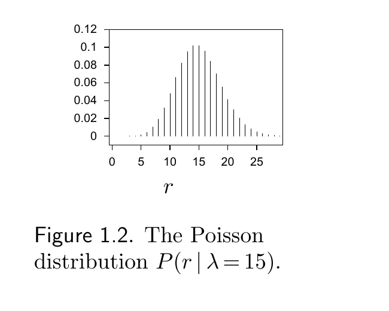
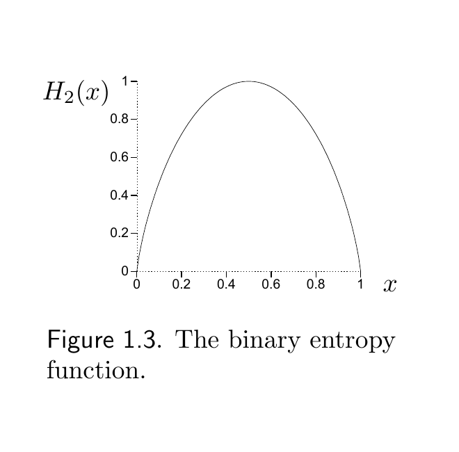

<!-- PDF 物理页 14；原书印刷页 2；“About Chapter 1”续。 -->

## 近似计算 $x!$ 和 $\binom Nr$

我们用一种不太常见的途径来推导斯特林近似。从均值为 $\lambda$ 的泊松分布出发：

$$P(r\mid\lambda)=e^{-\lambda}\frac{\lambda^r}{r!},\qquad r\in\{0,1,2,\ldots\}.\tag{1.8}$$

**图 1.2。**泊松分布 $P(r\mid\lambda=15)$。图内横轴 $r$ 为事件次数，纵轴为概率。

当 $\lambda$ 很大时，至少在 $r\simeq\lambda$ 附近，这个分布可以由均值和方差都为 $\lambda$ 的高斯分布很好地近似：

$$e^{-\lambda}\frac{\lambda^r}{r!}\simeq\frac{1}{\sqrt{2\pi\lambda}}e^{-(r-\lambda)^2/(2\lambda)}.\tag{1.9}$$

把 $r=\lambda$ 代入这个式子，再重新整理：

$$e^{-\lambda}\frac{\lambda^\lambda}{\lambda!}\simeq\frac{1}{\sqrt{2\pi\lambda}},\tag{1.10}$$

$$\Rightarrow\quad\lambda!\simeq\lambda^\lambda e^{-\lambda}\sqrt{2\pi\lambda}.\tag{1.11}$$

这就是阶乘函数的斯特林近似：

$$x!\simeq x^x e^{-x}\sqrt{2\pi x}\quad\Longleftrightarrow\quad\ln x!\simeq x\ln x-x+\tfrac12\ln(2\pi x).\tag{1.12}$$

这个推导不仅得到了主导阶 $x!\simeq x^x e^{-x}$，还顺便得到了下一阶的修正因子 $\sqrt{2\pi x}$。现在把斯特林近似用于 $\ln\binom Nr$：

$$\ln\binom Nr\equiv\ln\frac{N!}{(N-r)!\,r!}\simeq(N-r)\ln\frac{N}{N-r}+r\ln\frac Nr.\tag{1.13}$$

因为这个等式中的各项都是对数，所以可以换用任意底数。我们用“$\ln$”表示自然对数（以 $e$ 为底），用“$\log$”表示以 2 为底的对数。

**页边提示：**$\log_2x=\dfrac{\log_e x}{\log_e 2}$；$\dfrac{\partial\log_2x}{\partial x}=\dfrac{1}{\log_e2}\dfrac1x$。

引入二元熵函数：

$$H_2(x)\equiv x\log\frac1x+(1-x)\log\frac{1}{1-x},\tag{1.14}$$

**图 1.3。**二元熵函数。图内横轴为 $x$，纵轴为 $H_2(x)$。

于是，式 (1.13) 的近似可以写成：

$$\log\binom Nr\simeq N H_2(r/N),\tag{1.15}$$

或者等价地：

$$\binom Nr\simeq 2^{N H_2(r/N)}.\tag{1.16}$$

若需要更精确的近似，可以纳入斯特林近似 (1.12) 的下一阶项：

$$\log\binom Nr\simeq N H_2(r/N)-\tfrac12\log\!\left[2\pi N\frac{N-r}{N}\frac rN\right].\tag{1.17}$$
