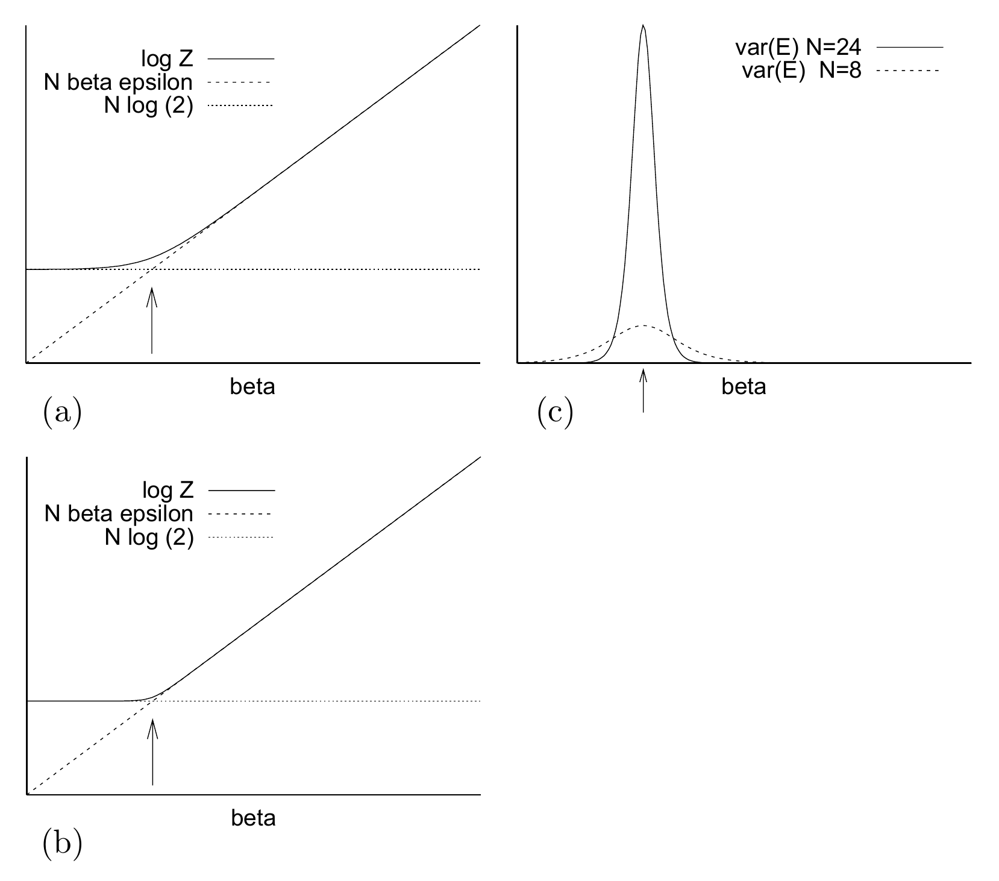
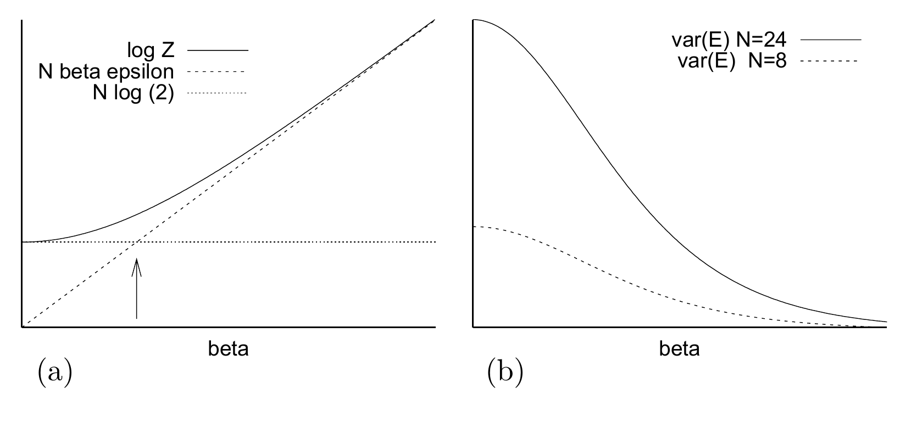

<!-- 原书 PDF 物理页 615，印刷页 603。图 B.1/B.2 均从原页高分辨率裁取；图注、图内标签、式(B.11)/(B.12)与跨616段落逐项核对。 -->

图 B.1　(a) 玩具系统的配分函数：当 $N$ 很大时，该系统会发生相变。箭头标出 $\beta_c=\log 2/\epsilon$。(b) 更大的 $N$ 下的同一函数。(c) 两种系统大小下，能量方差随 $\beta$ 的变化。随着 $N$ 增大，方差在临界点 $\beta_c$ 处的峰越来越尖锐。与图 B.2 比较。图内文字译注：(a)、(b) 的 `log Z` 为配分函数的对数（实线），`N beta epsilon` 为 $N\beta\epsilon$（虚线），`N log (2)` 为 $N\log(2)$（点线），`beta` 为横轴 $\beta$；(c) 的 `var(E) N=24` 和 `var(E) N=8` 分别为 $N=24$（实线）和 $N=8$（虚线）时的能量方差，横轴 `beta` 为 $\beta$。

图 B.2　由 $N$ 个独立自旋组成的系统，其配分函数 (a) 和能量方差 (b)。无论 $N$ 有多大，配分函数都是从一条渐近线逐渐过渡到另一条；能量方差没有峰。涨落在高温（小 $\beta$）时最大，并与系统大小 $N$ 成正比。图内文字译注：(a) 的 `log Z` 为配分函数的对数（实线），`N beta epsilon` 为 $N\beta\epsilon$（虚线），`N log (2)` 为 $N\log(2)$（点线），`beta` 为横轴 $\beta$；(b) 的 `var(E) N=24` 和 `var(E) N=8` 分别为 $N=24$（实线）和 $N=8$（虚线）时的能量方差，横轴 `beta` 为 $\beta$。

箭头标出两条渐近线的交点，即

$$\beta=\frac{\ln2}{\epsilon}\tag{B.11}$$

在极限 $N\to\infty$ 下，$\ln Z(\beta)$ 的图线会在这一点弯折得越来越尖锐（图 B.1b）。

$\ln Z$ 的二阶导数描述系统能量的方差。在 $\beta=\ln2/\epsilon$ 处，这个方差的峰值约为

$$\frac{N^2\epsilon^2}{4},\tag{B.12}$$

这对应于系统有一半时间处于基态，另一半时间处于其他状态。

因此，在这个临界点，系统热容与 $N^2$ 成正比；每个自旋的热容与 $N$ 成正比，在 $N\to\infty$ 时发散。而远离相变时，每个原子的热容则为有限值。

作为比较，图 B.2 给出了普通独立自旋系统的配分函数和能量方差。

### 更一般地说

相变可分为“一阶相变”和“连续相变”。在一阶相变中，一个或多个序参量发生不连续变化；在连续相变中，所有序参量都连续变化。［什么是序参量？它是系统状态的一个标量函数；更准确地说，是这个函数的期望值。］
