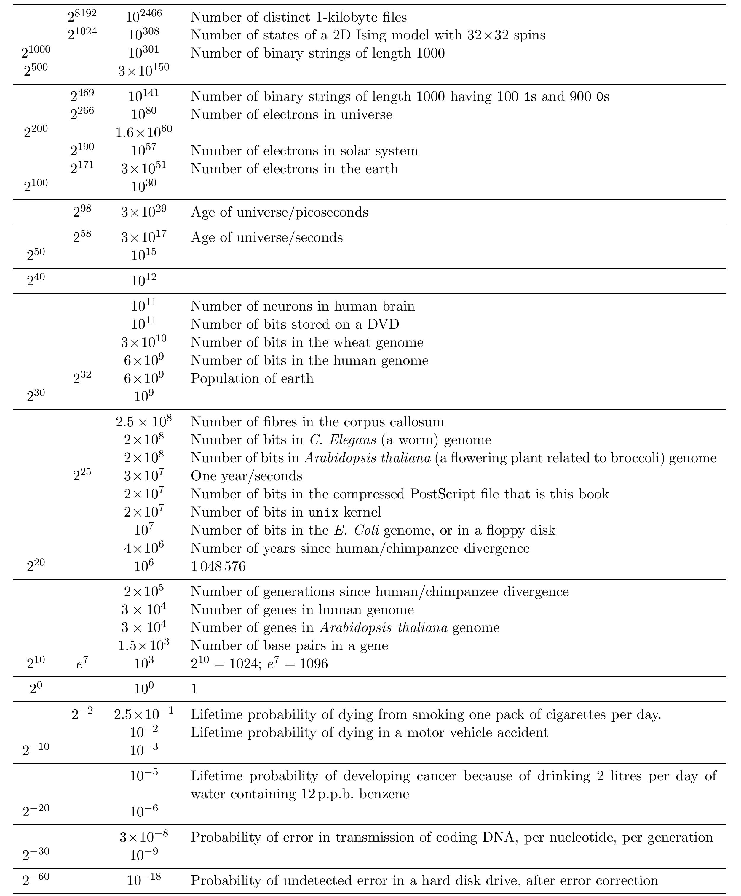

<!-- 原书 PDF 物理页 624，印刷页 612。§C.4 整页数值对照表据 4200px 可视原页逐行转写；原表裁图保留分组线、数值的四栏位置和原始字形，下表提供可复制中文对照。原书无表号与表头。 -->

## C.4　若干数值

|  |  |  |  |
| --- | --- | --- | --- |
|  | $2^{8192}$ | $10^{2466}$ | 不同的 1 千字节文件的数量 |
|  | $2^{1024}$ | $10^{308}$ | 有 $32\times32$ 个自旋的二维伊辛模型的状态数 |
| $2^{1000}$ |  | $10^{301}$ | 长度为 1000 的二进制字符串的数量 |
| $2^{500}$ |  | $3\times10^{150}$ |  |
|  | $2^{469}$ | $10^{141}$ | 长度为 1000、其中有 100 个 1 和 900 个 0 的二进制字符串的数量 |
|  | $2^{266}$ | $10^{80}$ | 宇宙中的电子数 |
| $2^{200}$ |  | $1.6\times10^{60}$ |  |
|  | $2^{190}$ | $10^{57}$ | 太阳系中的电子数 |
|  | $2^{171}$ | $3\times10^{51}$ | 地球中的电子数 |
| $2^{100}$ |  | $10^{30}$ |  |
|  | $2^{98}$ | $3\times10^{29}$ | 宇宙年龄／皮秒 |
|  | $2^{58}$ | $3\times10^{17}$ | 宇宙年龄／秒 |
| $2^{50}$ |  | $10^{15}$ |  |
| $2^{40}$ |  | $10^{12}$ |  |
|  |  | $10^{11}$ | 人脑中的神经元数量 |
|  |  | $10^{11}$ | 一张 DVD 存储的比特数 |
|  |  | $3\times10^{10}$ | 小麦基因组中的比特数 |
|  |  | $6\times10^9$ | 人类基因组中的比特数 |
|  | $2^{32}$ | $6\times10^9$ | 地球人口 |
| $2^{30}$ |  | $10^9$ |  |
|  |  | $2.5\times10^8$ | 胼胝体中的神经纤维数 |
|  |  | $2\times10^8$ | *C. elegans*（一种线虫）基因组中的比特数 |
|  |  | $2\times10^8$ | *Arabidopsis thaliana*（一种与西兰花有亲缘关系的开花植物）基因组中的比特数 |
|  | $2^{25}$ | $3\times10^7$ | 一年／秒 |
|  |  | $2\times10^7$ | 本书压缩后的 PostScript 文件中的比特数 |
|  |  | $2\times10^7$ | `unix` 内核中的比特数 |
|  |  | $10^7$ | *E. coli* 基因组或一张软盘中的比特数 |
|  |  | $4\times10^6$ | 人类与黑猩猩分化至今的年数 |
| $2^{20}$ |  | $10^6$ | $1\,048\,576$ |
|  |  | $2\times10^5$ | 人类与黑猩猩分化至今的世代数 |
|  |  | $3\times10^4$ | 人类基因组中的基因数 |
|  |  | $3\times10^4$ | *Arabidopsis thaliana* 基因组中的基因数 |
|  |  | $1.5\times10^3$ | 一个基因中的碱基对数量 |
| $2^{10}$ | $e^7$ | $10^3$ | $2^{10}=1024;\ e^7=1096$ |
| $2^0$ |  | $10^0$ | 1 |
|  | $2^{-2}$ | $2.5\times10^{-1}$ | 每天吸一包香烟的人，一生中因吸烟死亡的概率。 |
|  |  | $10^{-2}$ | 一生中死于机动车事故的概率 |
| $2^{-10}$ |  | $10^{-3}$ |  |
|  |  | $10^{-5}$ | 每天饮用 2 升含有 12 p.p.b. 苯的水，一生中因此患癌的概率 |
| $2^{-20}$ |  | $10^{-6}$ |  |
|  |  | $3\times10^{-8}$ | 编码 DNA 在传递中出错的概率：每个核苷酸、每一代 |
| $2^{-30}$ |  | $10^{-9}$ |  |
| $2^{-60}$ |  | $10^{-18}$ | 经纠错后，硬盘驱动器发生未检出错误的概率 |
