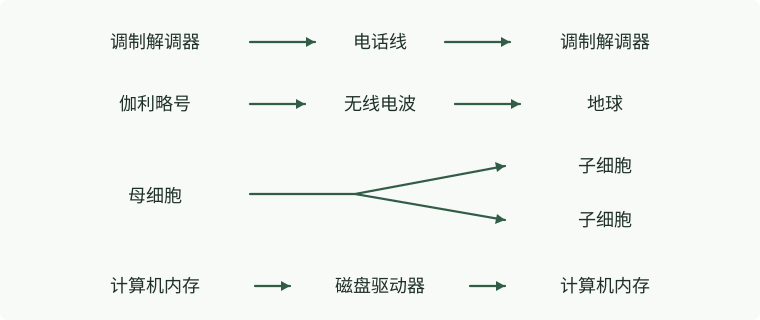

# 第 1 章 信息论导论

> **本章导读**：本章从有噪声的通信信道出发，说明为什么要给消息添加冗余、怎样用纠错码恢复信息，以及通信速率与差错概率之间的问题。后文会用香农的信道编码定理回答：有噪声时，可靠通信能达到多高的速率。

> “通信的根本问题是：在某个地点，精确地或近似地重现另一个地点所选定的一条消息。”——克劳德·香农，1948 年

本书的前半部分研究如何度量信息量，学习如何压缩数据，以及如何通过不完美的通信信道实现完全可靠的通信。我们先直观了解最后这个问题。

## 1.1 如何在不完善的有噪声信道上实现完全可靠的通信？

有噪声通信信道的例子包括：

- 模拟电话线：两台调制解调器通过它传送数字信息；
- 从环绕木星运行的“伽利略号”探测器到地球的无线电通信链路；
- 不断繁殖的细胞：子细胞的 DNA 含有来自母细胞的信息；
- 磁盘驱动器。

<!-- 原页右边栏的四组无编号通信示意图已重绘，须与上列四项一起编排。 -->

最后一个例子说明，通信不一定要把信息从一个地点送到另一个地点。我们把文件写入磁盘驱动器，随后会在同一个地点、却在更晚的时候把它读出来。

这些信道都有噪声。电话线会受到其他线路的串扰，线路硬件也会使传送的信号失真并加入噪声。监听“伽利略号”微弱发射信号的深空通信网，还会收到来自地面和宇宙的背景辐射。DNA 会发生突变和损伤。磁盘驱动器通过使一小块磁性材料沿两个方向之一磁化，写入一个二进制数字（1 或 0，也称为一位，bit），之后却可能无法正确读出：材料的磁化方向可能自行翻转；背景噪声的一次干扰可能让读取电路报告错误的位值；相邻位的干扰也可能使写入磁头一开始就未能使材料磁化。

在以上所有情况下，如果通过信道传送一串位这样的数据，收到的消息就有一定概率与发出的消息不同。我们希望这个概率为零，或小到在实际应用中与零无法区分。

<!-- 上一段跨 PDF 物理页 15–16；此处补齐原书第 16 页的续句，以便网页连续阅读。 -->
