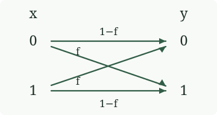
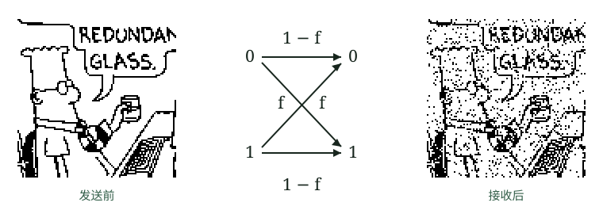

<!-- 本页开头的跨页段落已并入 pdf-015.md。 -->

设想一种有噪声的磁盘驱动器：它以概率 1 − f 正确传送每一位，以概率 f 错误传送每一位。这种通信信道模型称为**二元对称信道**（binary symmetric channel，图 1.4）。

图 1.4　二元对称信道。发送的符号为 $x$，收到的符号为 $y$；噪声水平 $f$ 是位翻转的概率。图中四种条件概率分别为：$P(y=0\mid x=0)=1-f$；$P(y=0\mid x=1)=f$；$P(y=1\mid x=0)=f$；$P(y=1\mid x=1)=1-f$。

图 1.5　长度为 10 000 的二进制数据序列，经噪声水平 f = 0.1 的二元对称信道传输。图中使用的 Dilbert 漫画，原书注明 © 1997 United Feature Syndicate, Inc.，经许可使用。图内英文“REDUNDANT GLASS”译为“冗余镜片”；左侧为原图，右侧为经过信道后的图像。

例如，设 f = 0.1，也就是 10% 的位发生翻转（图 1.5）。实用的磁盘驱动器在整个使用寿命中不应翻转任何一位。如果我们预计连续十年每天读写 1 GB 数据，那么所需的位错误概率必须在 10⁻¹⁵ 量级或更低。达到这个目标有两种方案。

### 物理方案

物理方案是改善通信信道的物理特性，以降低出错概率。我们可以通过以下办法改进磁盘驱动器：

1. 在电路中使用更可靠的元件；
2. 抽空磁盘外壳中的空气，消除使读磁头偏离磁道的湍流；
3. 用更大的磁性区域表示每一位；或者
4. 使用功率更高的信号，或给电路降温，以减少热噪声。

这些物理改动通常会增加通信信道的成本。

### “系统”方案

信息论和编码理论提供了另一条（也有趣得多的）道路：接受既有信道会产生噪声这一事实，再给它配上通信系统，以检测并纠正信道造成的错误。如图 1.6 所示，我们在信道前加入编码器，在信道后加入解码器。编码器把源消息 s 编码成待发送消息 t，以某种方式给原消息加入冗余。信道使待发送消息受到噪声干扰，得到接收消息 r。解码器利用编码系统加入的已知冗余，推断原始信号 s 和加入的噪声。

<!-- 最后一段在原书 PDF 第 17 页的图 1.6 继续；图 1.6 见 pdf-017.md。 -->
