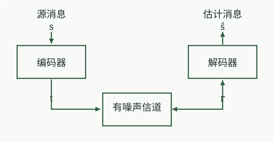
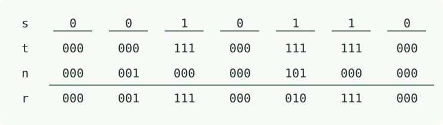

图 1.6　通过有噪声信道实现可靠通信的“系统”方案。编码系统在发送向量 t 中加入系统性的冗余。解码系统利用这些已知冗余，从接收向量 r 推断出原始源向量和信道加入的噪声。

物理方案的成本不断增加，却只能逐步改善信道；系统方案则可以把有噪声的信道变成可靠的通信信道，代价只是编码器和解码器所需的计算。

**信息论**研究这类系统的理论限制与潜力：“我们能获得的最佳纠错性能是什么？”

**编码理论**研究如何构造实用的编码和解码系统。

## 1.2 二元对称信道的纠错码

下面考察一些编码和解码系统。要给传输过程加入有用的冗余，最简单的办法是什么？【先明确规则：我们希望检测并纠正错误；重新发送不在允许之列。编码、发送和解码各只有一次机会。】

### 重复码

一个直接的想法是，把消息中的每一位重复预先约定的次数，例如重复三次，如表 1.7 所示。我们把这种重复码称为 R₃。

| 源序列 s | 发送序列 t |
| :---: | :---: |
| 0 | 000 |
| 1 | 111 |

表 1.7　重复码 R₃。

假设要发送源消息

`s = 0 0 1 0 1 1 0`

并采用这种重复码，使它经过噪声水平 f = 0.1 的二元对称信道。我们可以把信道描述为给发送向量“加上”一个稀疏的噪声向量 n。这里的加法是**模 2 加法**：在这种二进制运算中，1 + 1 = 0。图 1.8 给出了一个可能的噪声向量 n，以及相应的接收向量 r = t + n。

图 1.8　使用 R₃ 的一次传输示例。

该怎样解码这个接收向量？最优算法每次查看三个接收位，采用多数表决（算法 1.9）。
