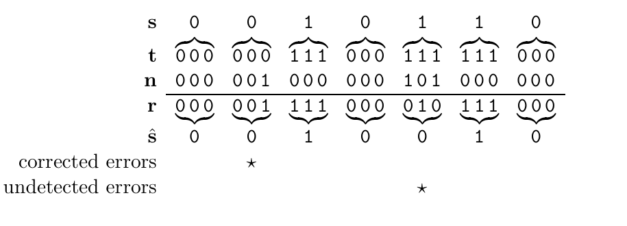
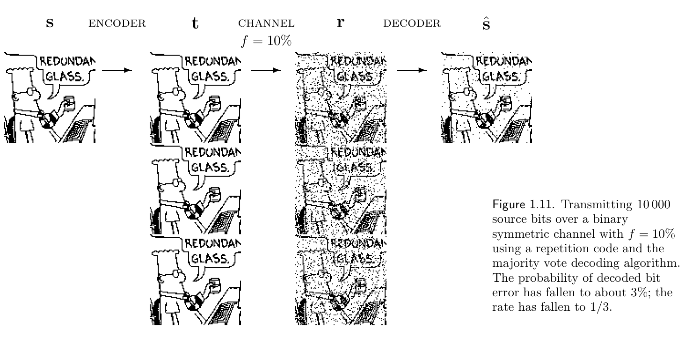

<!-- PDF 物理页 19；原书印刷页 7。 -->

所以，只要我们假定信道是二元对称信道，而且两个可能的源消息 0 和 1 具有相等的先验概率，算法 1.9 所示的多数表决解码器就是最优解码器。

现在把多数表决解码器用于图 1.8 的接收向量。头三个接收位都是 0，因此把这组三位解码为 0。图 1.8 的第二组三位中有两个 0、一个 1，因此也把这组解码为 0；在此例中，这样便纠正了错误。然而，并不是所有错误都能被纠正。如果运气不好，一个数据块中出现两个错误，比如图 1.8 的第五组三位，那么解码规则就会得出错误答案，如图 1.10 所示。

图 1.10　对图 1.8 的接收向量进行解码。图中的 `corrected errors` 表示“已纠正的错误”，`undetected errors` 表示“未检测到的错误”；$s,t,n,r,\hat s$ 依次是源序列、发送序列、噪声序列、接收序列和解码序列。

**习题 1.2。**［2；解答见原书印刷第 16 页］计算噪声水平为 $f$ 的二元对称信道上重复码 $R_3$ 的错误概率，以证明采用 $R_3$ 能降低错误概率。

错误概率主要由三位数据块中有两位发生翻转的概率决定，它按 $f^2$ 的量级变化。对于 $f=0.1$ 的二元对称信道，$R_3$ 解码后的每位错误概率约为 $p_b\simeq0.03$。图 1.11 展示了用重复码通过二元对称信道传输一幅二值图像的结果。

图 1.11　通过噪声水平 $f=10\%$ 的二元对称信道传送 10 000 个源位，采用重复码和多数表决解码算法。解码后的每位错误概率降至约 $3\%$；速率则降为 $1/3$。图内 `ENCODER`、`CHANNEL`、`DECODER` 分别为“编码器”“信道”“解码器”；漫画气泡中的 `REDUNDANT GLASS` 为“冗余镜片”；$s,t,r,\hat s$ 分别表示源、发送、接收和解码序列。

**页边说明。**习题难度标注中的数字，例如“［2］”，表示习题难度；“［1］”为最简单的习题。页边有小鼠标记的习题特别值得做。如果书中给出了全部或部分解答，页码会标在难度数字之后；例如，以上习题的解答在原书印刷第 16 页。
