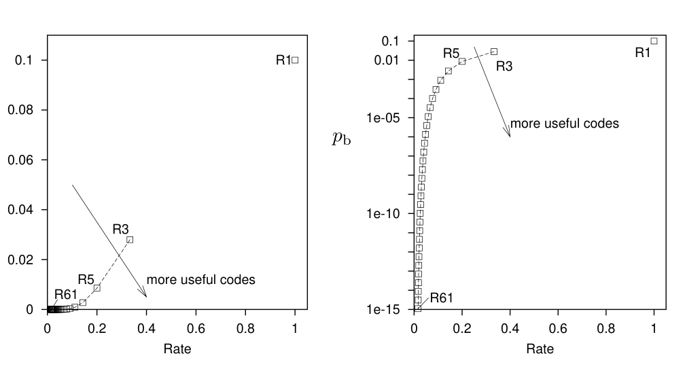

<!-- PDF 物理页 20；原书印刷页 8。 -->

图 1.12　噪声水平 $f=0.1$ 的二元对称信道上，重复码的位错误概率 $p_b$ 与速率的关系。右图以对数刻度绘制 $p_b$。我们希望速率高、$p_b$ 小。图内横轴 `Rate` 为“速率”；`more useful codes` 为“更实用的编码”；$R_1$、$R_3$、$R_5$、$R_{61}$ 分别表示相应重复次数的重复码。

由此，重复码 $R_3$ 确实按预期降低了错误概率。不过我们失去了一样东西：信息传输速率降至原来的三分之一。如果通过电话线使用重复码传送数据，它会降低错误频率，也会降低通信速率；每通电话得付出三倍的费用。同样，为了用位错误概率 $p_b=0.03$ 的嘈杂磁盘驱动器造出容量为 1 GB 的驱动器，需要三台原有的驱动器。

我们能把错误概率进一步压低，达到一台可销售的磁盘驱动器所需的 $10^{-15}$ 吗？增加重复码的重复次数，就能得到更低的错误概率。

**习题 1.3。**［3；解答见原书印刷第 16 页］

(a) 证明重复 $N$ 次的重复码 $R_N$，在 $N$ 为奇数时的错误概率为

$$p_b=\sum_{n=(N+1)/2}^{N}\binom{N}{n}f^n(1-f)^{N-n}.\tag{1.24}$$

(b) 设 $f=0.1$，这个和式中哪一项最大？它比第二大的项大多少？

(c) 用斯特林近似（原书印刷第 2 页）近似计算最大项中的 $\binom{N}{n}$，从而求出重复 $N$ 次的重复码错误概率的近似值。

(d) 设 $f=0.1$，求把错误概率降到 $10^{-15}$ 所需的重复次数。［答案：约 60 次。］

因此，若以噪声水平 $f=0.1$ 的嘈杂 GB 驱动器为材料，想造出一台具有所需可靠性的**单台** GB 驱动器，就得用到 **60 台**嘈杂驱动器。重复码的错误概率与速率之间的取舍如图 1.12 所示。

### 分组码：$(7,4)$ 汉明码

我们希望通信错误概率极小，同时保持相当高的速率。能否做得比重复码更好？如果不再逐位编码，而是给成组的数据加入冗余，会怎样？下面研究一种简单的分组码。
