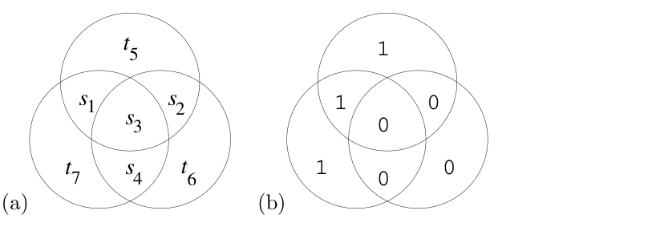

<!-- PDF 物理页 21；原书印刷页 9。 -->

**分组码**（block code）是一条规则：把长度为 $K$ 的源位序列 $\mathbf s$ 转换为长度为 $N$ 位的发送序列 $\mathbf t$。为了加入冗余，令 $N>K$。在线性分组码中，额外的 $N-K$ 位是原来 $K$ 位的线性函数，称为**奇偶校验位**（parity-check bits）。线性分组码的一个例子是 $(7,4)$ **汉明码**（Hamming code）：每 4 个源位发送 $N=7$ 位。

图 1.13　$(7,4)$ 汉明码编码过程的图示。(a) 四个源位 $s_1,s_2,s_3,s_4$ 位于三个相交圆中，$t_5,t_6,t_7$ 为奇偶校验位；(b) 是源序列 $\mathbf s=1000$ 时的取值。

图 1.13 直观展示了该码的编码操作。我们把七个发送位放在三个相交的圆内。前四个发送位 $t_1t_2t_3t_4$ 直接取为四个源位 $s_1s_2s_3s_4$。设置奇偶校验位 $t_5t_6t_7$，使每个圆内都有偶数个 1：第一个校验位是前三个源位的校验位（它等于这三位之和为偶数时的 0、和为奇数时的 1）；第二个是后三个源位的校验位；第三个则校验第一、第三、第四个源位。

作为例子，图 1.13b 给出了 $\mathbf s=1000$ 时发送的码字。表 1.14 列出四个源位的 $2^4=16$ 种取值各自产生的码字。这些码字有一个特殊性质：任意两个码字至少有三位不同。

| 源位 $\mathbf s$ | 码字 $\mathbf t$ | 源位 $\mathbf s$ | 码字 $\mathbf t$ | 源位 $\mathbf s$ | 码字 $\mathbf t$ | 源位 $\mathbf s$ | 码字 $\mathbf t$ |
| :---: | :---: | :---: | :---: | :---: | :---: | :---: | :---: |
| 0000 | 0000000 | 0100 | 0100110 | 1000 | 1000101 | 1100 | 1100011 |
| 0001 | 0001011 | 0101 | 0101101 | 1001 | 1001110 | 1101 | 1101000 |
| 0010 | 0010111 | 0110 | 0110001 | 1010 | 1010010 | 1110 | 1110100 |
| 0011 | 0011100 | 0111 | 0111010 | 1011 | 1011001 | 1111 | 1111111 |

**表 1.14。**$(7,4)$ 汉明码的 16 个码字 $\{\mathbf t\}$。任意两个码字至少有三位不同。

汉明码是线性码，因此可用矩阵紧凑表示。发送码字 $\mathbf t$ 可由源序列 $\mathbf s$ 经过线性运算得到：

$$\mathbf t=\mathbf G^{\mathsf T}\mathbf s,\tag{1.25}$$

其中 $\mathbf G$ 是该码的**生成矩阵**，

$$\mathbf G^{\mathsf T}=\begin{bmatrix}1&0&0&0\\0&1&0&0\\0&0&1&0\\0&0&0&1\\1&1&1&0\\0&1&1&1\\1&0&1&1\end{bmatrix},\tag{1.26}$$

而编码运算（1.25）采用模 2 算术（$1+1=0$、$0+1=1$ 等）。

在式（1.25）的编码运算中，我假定 $\mathbf s$ 和 $\mathbf t$ 都是列向量。如果把它们改用行向量表示，式子就变为

$$\mathbf t=\mathbf s\mathbf G,\tag{1.27}$$
