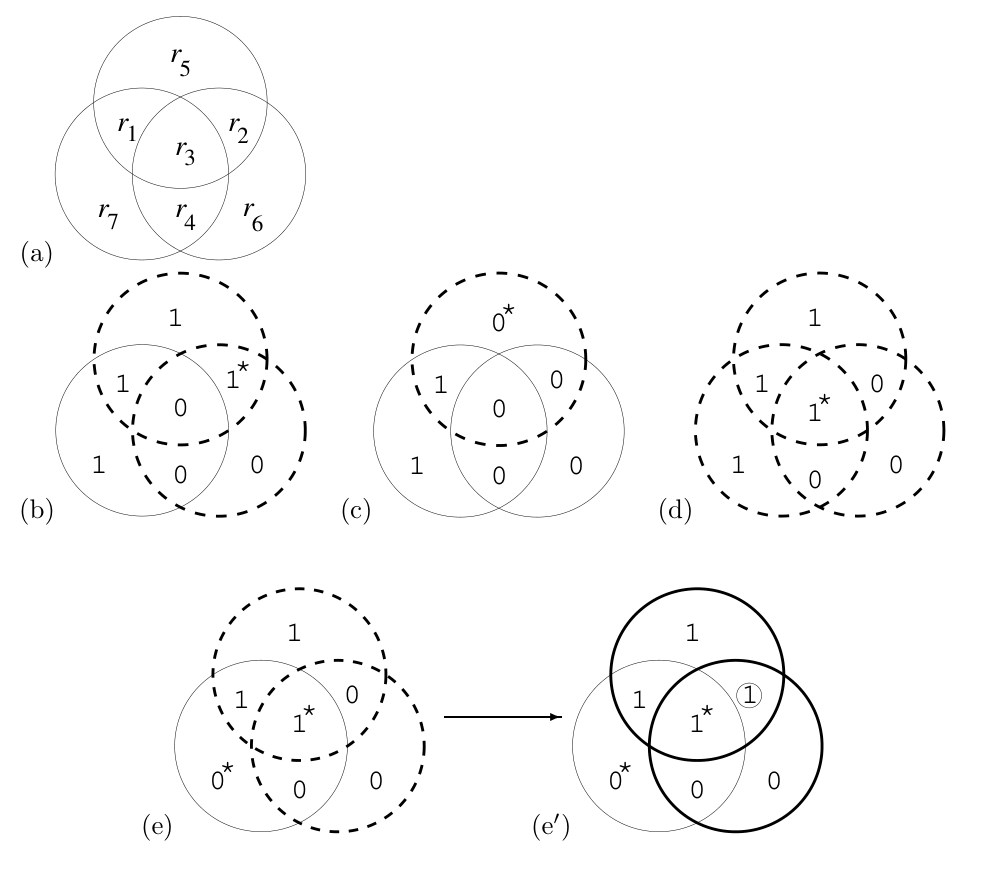

<!-- PDF 物理页 23；原书印刷页 11。 -->

图 1.15　$(7,4)$ 汉明码解码过程的图示。(a) 展示如何把接收向量填入图中。(b)、(c)、(d)、(e) 假设发送向量与图 1.13b 相同，星号标记被翻转的位。违反奇偶校验的圆用虚线突出显示。对于每种“伴随式”——也就是哪些校验满足、哪些校验不满足的模式——七个位中总有一位是最可能的可疑位。(b)、(c)、(d) 中，最可能的可疑位正是实际翻转的那一位。(e) 中，源位 $s_3$ 和校验位 $t_7$ 两位都发生翻转；最可能被怀疑的是 $r_2$，它在展示解码算法输出的 (e′) 中被圈出。

| 伴随式 $\mathbf z$ | 000 | 001 | 010 | 011 | 100 | 101 | 110 | 111 |
| :--- | :---: | :---: | :---: | :---: | :---: | :---: | :---: | :---: |
| 撤销翻转的位 | 无 | $r_7$ | $r_6$ | $r_4$ | $r_5$ | $r_1$ | $r_2$ | $r_3$ |

**算法 1.16。**假定二元对称信道的噪声水平 $f$ 很小，$(7,4)$ 汉明码的最优解码器采取的操作。伴随式向量 $\mathbf z$ 依次对应 $r_5$、$r_6$、$r_7$ 三项奇偶校验：校验不满足记为 1，满足记为 0。

试着逐个翻转这七个位中的任意一位，就会发现每次都得到不同的伴随式：七个非零伴随式，分别对应七个位。另一个伴随式只有一个，即全零伴随式。因此，如果信道是噪声水平 $f$ 很小的二元对称信道，最优解码器根据伴随式最多撤销一个位的翻转，如算法 1.16 所示。每个伴随式也可能由其他噪声模式引起，但具有相同伴随式的其他噪声模式涉及更多次噪声事件，因此概率更低。

如果噪声实际翻转了不止一位，会发生什么？图 1.15e 展示收到的 $r_3$ 和 $r_7$ 都被翻转的情形。伴随式 110 使我们怀疑单独的 $r_2$，于是最优解码算法翻转它，得到的解码结果包含三个错误，如图 1.15e′ 所示。使用最优解码算法时，任何两位错误模式都会得到一个含三处错误的七位解码向量。

### 线性码解码的一般观点：伴随式解码

线性码的解码问题也可以用矩阵来描述。接收序列的前四位 $r_1r_2r_3r_4$ 被当成四个源位；后三位 $r_5r_6r_7$ 则被当成源位的奇偶校验值，其定义由生成矩阵 $\mathbf G$ 给出。我们对收到的前四位 $r_1r_2r_3r_4$ 计算三个奇偶校验位，再检查它们是否与收到的后三位 $r_5r_6r_7$ 相同。这两个三位组之差（模 2）称为接收向量的**伴随式**。如果伴随式为零，即三项奇偶校验都满足，接收向量就是一个码字，最可能的解码是直接读取它的前四位。如果伴随式非零，那么这个数据块的噪声序列就非零；伴随式为我们指向最可能的错误模式。

<!-- 上段最后两句续自原书 PDF 物理页 24；为保持网页段落连贯，合并至本页。 -->
