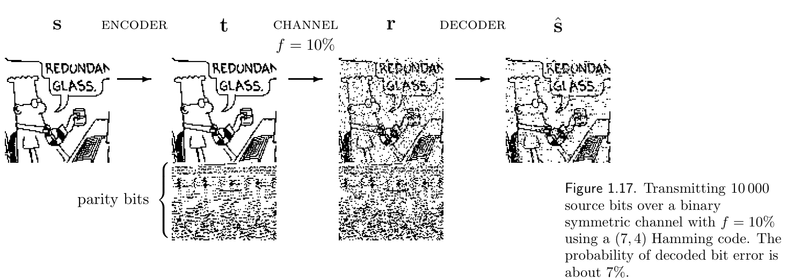

<!-- PDF 物理页 24；原书印刷页 12。页首正文跨页续句已并入 pdf-023.md 末段。 -->

图 1.17　使用 $(7,4)$ 汉明码，通过噪声水平 $f=10\%$ 的二元对称信道传送 10 000 个源位。解码后的位错误概率约为 $7\%$。图内 `ENCODER`、`CHANNEL`、`DECODER` 分别为“编码器”“信道”“解码器”，`parity bits` 为“奇偶校验位”，漫画气泡中的 `REDUNDANT GLASS` 为“冗余镜片”；$s,t,r,\hat s$ 分别表示源、发送、接收和解码序列。

伴随式向量的计算是一种线性运算。定义 $3\times4$ 矩阵 $\mathbf P$，使式（1.26）中的矩阵可写成

$$\mathbf G^{\mathsf T}=\begin{bmatrix}\mathbf I_4\\\mathbf P\end{bmatrix},\tag{1.29}$$

其中 $\mathbf I_4$ 是 $4\times4$ 单位矩阵。于是伴随式向量为 $\mathbf z=\mathbf H\mathbf r$，其中**奇偶校验矩阵** $\mathbf H=\begin{bmatrix}-\mathbf P&\mathbf I_3\end{bmatrix}$。在模 2 算术中，$-1\equiv1$，所以

$$\mathbf H=\begin{bmatrix}\mathbf P&\mathbf I_3\end{bmatrix}=\begin{bmatrix}1&1&1&0&1&0&0\\0&1&1&1&0&1&0\\1&0&1&1&0&0&1\end{bmatrix}.\tag{1.30}$$

该码的所有码字 $\mathbf t=\mathbf G^{\mathsf T}\mathbf s$ 都满足

$$\mathbf H\mathbf t=\begin{bmatrix}0\\0\\0\end{bmatrix}.\tag{1.31}$$

▷ **习题 1.4。**［1］计算 $3\times4$ 矩阵 $\mathbf H\mathbf G^{\mathsf T}$，证明式（1.31）。

由于接收向量 $\mathbf r=\mathbf G^{\mathsf T}\mathbf s+\mathbf n$，伴随式解码问题就是找到满足下式的最可能噪声向量 $\mathbf n$：

$$\mathbf H\mathbf n=\mathbf z.\tag{1.32}$$

能解决这一问题的解码算法叫作**最大似然解码器**（maximum-likelihood decoder）。我们将在后面的章节讨论类似的解码问题。

### $(7,4)$ 汉明码的性质小结

每个可能的七位接收向量，要么本身是码字，要么只需翻转一位就能变成某个码字。

有三条奇偶校验约束，每条都可能满足或不满足，因此共有 $2\times2\times2=8$ 种不同的伴随式。它们可分为七个非零伴随式——分别对应七种单比特错误模式——以及对应零噪声情况的全零伴随式。

伴随式为零时，最优解码器不采取操作；否则，它利用非零伴随式与单比特错误模式之间的映射，撤销对可疑位的翻转。
