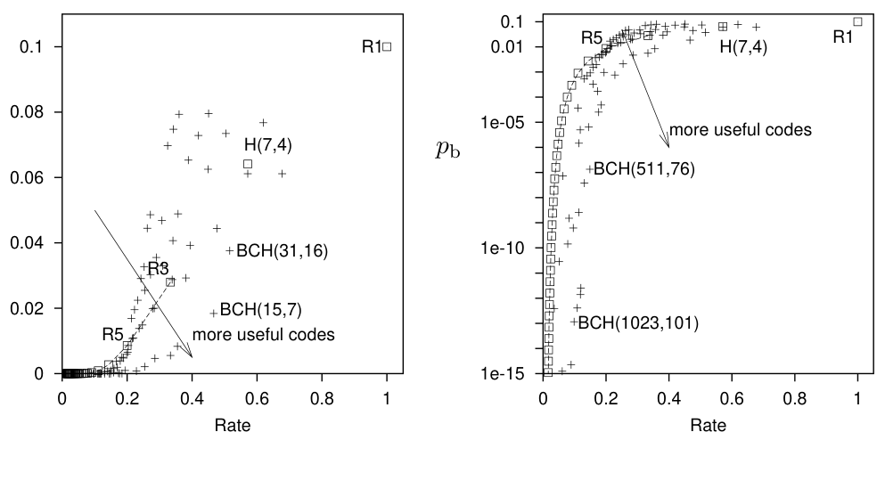

图 1.18　当二元对称信道的噪声水平 f = 0.1 时，重复码、(7, 4) 汉明码，以及分组长度最高为 1023 的 BCH 码，其位差错概率 p_b 与码率 R 的关系。右图的 p_b 采用对数刻度。图内文字：Rate＝码率；more useful codes＝更实用的码；R₁、R₃、R₅、H(7,4) 和 BCH(...) 是各个码的名称与参数。

 **习题 1.9**〔难度 4；解答见原书印刷页 19〕设计一种纠错码及其解码算法，估算它的差错概率，并把它加到图 1.18 中。【如果你发现很难设计出优于汉明码的码，或者很难为自己的码找到好的解码器，不必担心；这正是本题要说明的。】

 **习题 1.10**〔难度 3；解答见原书印刷页 20〕(7, 4) 汉明码能纠正任意一个错误；是否可能存在一个能纠正任意两个错误的 (14, 8) 码？

附加选做：这个问题的答案是否取决于该码是线性的还是非线性的？

 **习题 1.11**〔难度 4；解答见原书印刷页 21〕设计一种非重复码的纠错码，使它能纠正长度为 N 的分组中的任意两个错误。

## 1.3 最好的编码能达到什么性能？

解码后的位差错概率 p_b（我们希望降低它）与码率 R（我们希望保持较高）之间似乎存在权衡。怎样描述这种权衡？在 (R, p_b) 平面上，哪些点可以实现？克劳德·香农在 1948 年的开创性论文中探讨了这个问题；他在那篇论文中创立了信息论，也解决了这个领域的大部分根本问题。

当时，人们普遍相信，在 (R, p_b) 平面上，可实现与不可实现区域的边界是一条通过原点 (R, p_b) = (0, 0) 的曲线。如果真是这样，要把差错概率 p_b 降到接近零，就必须相应地把码率降到接近零——可谓“不付出就没有收获”。

∗　但香农证明了一个了不起的结果：如图 1.19 所示，可实现区域与不可实现区域的边界在 R 轴上交于一个非零值 R = C。对于任何信道，都存在这样的码：它们能以非零码率通信，同时把差错概率 p_b 降到任意小。本书前半部分（第 I–III 部）将用于理解这一结果，它称为**有噪声信道编码定理**（noisy-channel coding theorem）。

### 例子：f = 0.1

在位差错概率可以任意小的条件下，通信所能达到的最大码率称为信道的**容量**（capacity）。噪声水平为 f 的二元对称信道的容量为：

<!-- 公式 (1.35) 位于下一 PDF 物理页。 -->
