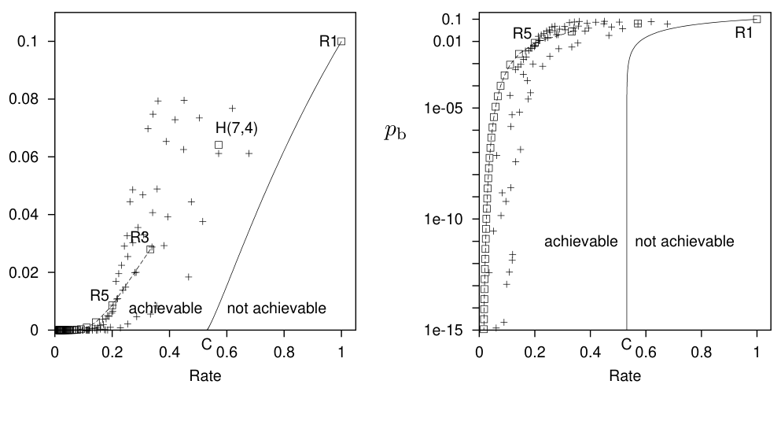

图 1.19　香农的有噪声信道编码定理。对于 f = 0.1 的二元对称信道，实线是 (R, p_b) 的可实现值所受的香农界。只要码率不超过 R = C，就能把 p_b 降到任意小。图中的点表示一些教科书中码的性能，与图 1.18 相同。定义香农界（实线）的方程是 R = C/[1 − H₂(p_b)]，其中 C 和 H₂ 见式 (1.35)。图内文字：Rate＝码率；achievable＝可实现；not achievable＝不可实现。

$$
C(f)=1-H_2(f)=1-\left[f\log_2\frac{1}{f}+(1-f)\log_2\frac{1}{1-f}\right]. \tag{1.35}
$$

我们前面讨论的信道在 f = 0.1 时的容量约为 C ≃ 0.53。想一想这对有噪声的磁盘驱动器意味着什么。重复码 R₃ 能以码率 R = 1/3 在该信道上传送数据，使 p_b = 0.03。因此，我们知道怎样用三个有噪声的 1 GB 磁盘驱动器，构成一个 p_b = 0.03 的 1 GB 驱动器。我们还知道怎样用 60 个有噪声的 1 GB 驱动器，构成一个 p_b ≃ 10⁻¹⁵ 的 1 GB 驱动器（习题 1.3，原书印刷页 8）。这时香农路过，看见我们在忙着摆弄磁盘和编码，说：

> “你想要达到什么性能？10⁻¹⁵？你用不着 60 个磁盘驱动器——只需两个就能达到（因为 1/2 小于 0.53）。而且，如果你想要 p_b = 10⁻¹⁸、10⁻²⁴，或者其他任意小的值，也都可以只用两个磁盘驱动器！”

【严格说来，上述说法也许不完全正确。我们将看到，香农是通过考察分组长度不断增大的分组码序列，来证明他的有噪声信道编码定理的。所需的分组长度可能超过 1 GB（即我们假定的磁盘容量）。那样一来，香农也许会说：“好吧，用这些小磁盘你做不到；但如果有两个有噪声的 1 TB 驱动器，你就能用它们做出一个高质量的 1 TB 驱动器。”】

## 1.4 小结

### (7, 4) 汉明码

在一个 7 位分组中加入 3 个校验位，就能检测并纠正该分组内任意一个位错误。

### 香农的有噪声信道编码定理

信息可以通过有噪声的信道以非零码率传送，同时使差错概率任意小。
