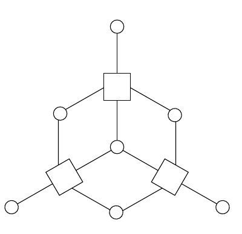

所有列都向右移动一位，最右列又出现在最左边；这就是对列作循环置换。

这样就证明了七个位之间的对称性。把上述过程再重复五次，就能为同一个原始码构造出总共七个不同的 $\mathbf H$ 矩阵；在这些矩阵中，每个位都分别承担不同的角色。

还可以为这个码构造一个极度冗余的七行奇偶校验矩阵：

$$\mathbf H'''=\begin{bmatrix}1&1&1&0&1&0&0\\0&1&1&1&0&1&0\\0&0&1&1&1&0&1\\1&0&0&1&1&1&0\\0&1&0&0&1&1&1\\1&0&1&0&0&1&1\\1&1&0&1&0&0&1\end{bmatrix}.\tag{1.54}$$

这个矩阵之所以“冗余”，是因为各行张成的空间只有三维，而不是七维。

它也是一个**循环矩阵**：每一行都是第一行的循环置换。

**循环码：**如果能把位 $t_1\ldots t_N$ 排成某种顺序，使一个线性码具有循环的奇偶校验矩阵，就称它为循环码。

这种码的码字也具有循环性质：对任一码字作循环置换，得到的仍是码字。

例如，按上述顺序排列各个位时，$(7,4)$ 汉明码的码字包括 `1110100` 和 `1011000` 各自的全部七种循环移位，以及 `0000000` 和 `1111111`。

循环码是纠错码代数方法的基石。不过，本书后文不再使用它们，因为稀疏图码（第 VI 部分）已经取代了它们。

**习题 1.7 的解答（原书印刷第 13 页）。**会产生全零伴随式的非零噪声向量共有 15 个；它们恰好就是汉明码的 15 个非零码字。注意，汉明码是线性码，因此任意两个码字之和仍是码字。

### 与码对应的图

**习题 1.9 的解答（原书印刷第 14 页）。**做这道题时，你可能发现，构造新码比为它寻找最优解码器容易。设计码有许多方法，下面只展示一种可能的思路。我们要构造一种类似 $(7,4)$ 汉明码、但规模更大的线性分组码。

许多码都可以方便地用图表示。图 1.13 曾以图形方式表示 $(7,4)$ 汉明码。该图中的每个大圆圈都表示四个特定位的奇偶性为偶数。把大圆圈换成与这四个位相连的“奇偶校验节点”，就得到图 1.20 中用二部图表示的 $(7,4)$ 汉明码。七个圆圈是七个发送位；三个方框是奇偶校验节点，不要把它们与三个奇偶校验位混淆——后者是图中最外围的三个圆圈。该图是二部图，因为节点分为位节点和校验节点两类。

图 1.20　$(7,4)$ 汉明码的图。七个圆圈是位节点，三个方框是奇偶校验节点。
