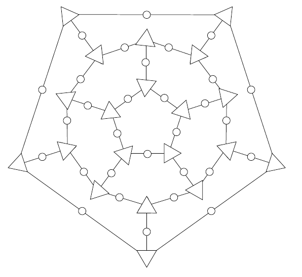
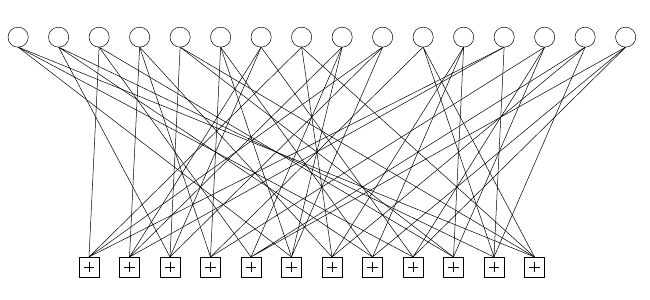

而且边只连接不同类别的节点。这个图与该码的奇偶校验矩阵（1.30）之间的对应关系很简单：每个奇偶校验节点对应 $\mathbf H$ 的一行，每个位节点对应 $\mathbf H$ 的一列；$\mathbf H$ 中每有一个 1，相应的两个节点之间就有一条边。

看到线性码与图的这种联系后，一种构造线性码的方法就是先构思一个二部图。例如，可以从十二面体得到一个漂亮的二部图：把十二面体的顶点称为奇偶校验节点，在每条边上放一个发送位。由此得到的奇偶校验矩阵，每列的重量为 2，每行的重量为 3。［一个二元向量的**重量**是其中 1 的个数。］

图 1.21　定义 $(30,11)$ 十二面体码的图。圆圈是 30 个发送位，三角形是 20 项奇偶校验。其中一项奇偶校验是冗余的。

这个码有 $N=30$ 位，表面上有 $M_{\mathrm{apparent}}=20$ 条奇偶校验约束。实际上，只有 $M=19$ 条约束相互独立；第 20 条是冗余的，也就是说，若其余 19 条都满足，它就会自动满足。因此，源位数为 $K=N-M=11$，这是一个 $(30,11)$ 码。

很难为这个码找到解码算法，但可以通过寻找最小重量的码字来估计它的错误概率。如果把原始十二面体某个面周围所有边上的位都翻转，那么所有奇偶校验仍然满足；因此，该码有 12 个重量为 5 的码字，每个面对应一个。最小重量的码字重量为 5，所以我们说该码的**距离**为 $d=5$；$(7,4)$ 汉明码的距离为 3，能纠正所有单个位翻转错误。距离为 5 的码能纠正所有双位翻转错误，但有些三位翻转错误无法纠正。因此，假定信道是二元对称信道，至少在噪声水平 $f$ 很低时，这个码的错误概率主要由 $f^3$ 量级的项决定，或许类似于

$$12\binom53 f^3(1-f)^{27}.\tag{1.55}$$

当然，并不要求码的图像这个例子一样能够画在平面上。那些可以用简单的图形描述的优秀线性码，其图往往更加错综复杂；图 1.22 中的小型 $(16,4)$ 码就是一个例子。

图 1.22　码率为 $1/4$、分组长度为 $N=16$、有 $M=12$ 条奇偶校验约束的低密度奇偶校验码（Gallager 码）的图。每个白色圆圈表示一个发送位；每个位参与 $j=3$ 条约束，约束用带加号的方框表示。节点之间的边是随机设置的。详见第 47 章。

此外，也没有理由只采用线性码；一些非线性码有很好的性质，它们的码字不能用 $\mathbf H\mathbf t=\mathbf0$ 这样的线性方程定义。不过，非线性码的编码和解码更棘手。

**习题 1.10 的解答（原书印刷第 14 页）。**先假设我们构造的是线性码，并采用伴随式解码。如果发送了 $N$ 位，那么重量不超过 2 的可能错误模式数为

$$\binom N2+\binom N1+\binom N0.\tag{1.56}$$

当 $N=14$ 时，它们共有 $91+14+1=106$ 种。每一种可区分的错误模式都必须产生不同的伴随式；伴随式是一个由 $M$ 位组成的序列，因此最多只有 $2^M$ 种伴随式。对于 $(14,8)$ 码，$M=6$，所以最多只有 $2^6=64$ 种伴随式。重量不超过 2 的可能错误模式有 106 种，多于 64 种伴随式，因此可以立即排除存在能纠正两个错误的 $(14,8)$ 码的可能。
