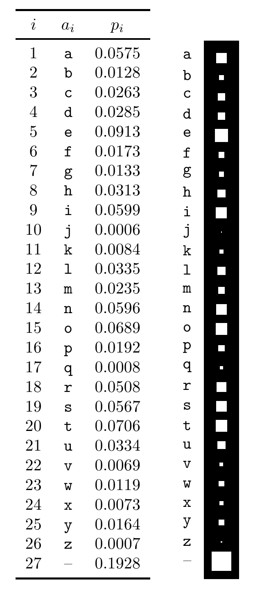

# 第 2 章 概率、熵与推断

> **本章导读**：本章先明确概率模型和条件概率的记号，再用贝叶斯定理说明怎样由观察结果推断未知原因。随后定义信息量与熵，并讨论熵的分解和相关不等式。

本章及与之对应的第 8 章，会花一些篇幅讨论记号。正如白骑士区分一首歌、歌的名字以及歌名叫什么（Carroll，1998），我们有时也需要仔细区分随机变量、随机变量的取值，以及断言该变量取某个值的命题。不过，在每一章里，我仍会尽可能使用简单、易懂的记号，即使这可能让严格讲究形式的读者不快。例如，如果某事“以概率 1 为真”，我通常就直接说它“为真”。

## 2.1 概率与系综

**系综（ensemble）** $X$ 是一个三元组 $(x,\mathcal A_X,\mathcal P_X)$。其中，结果 $x$ 是一个随机变量的取值；它可以取值于集合 $\mathcal A_X=\{a_1,a_2,\ldots,a_i,\ldots,a_I\}$，各取值的概率为 $\mathcal P_X=\{p_1,p_2,\ldots,p_I\}$，并满足 $P(x=a_i)=p_i$、$p_i\geq0$ 和 $\sum_{a_i\in\mathcal A_X}P(x=a_i)=1$。

$\mathcal A$ 这个记号取自“字母表”（alphabet）。从英语文档中随机选取的一个字符，就是系综的例子，见图 2.1。它有 27 种可能结果：字母 a–z，以及图中用“–”表示的空格。

图 2.1　从英语文档中随机抽取一个字符时，27 种可能结果的概率分布；数据估计自 *The Frequently Asked Questions Manual for Linux*。图中列出了序号 $i$、字符 $a_i$ 和概率 $p_i$；右侧白色方块的面积表示对应概率。“–”代表空格。

**简写。**有时会使用较短的记号。例如，$P(x=a_i)$ 可以写作 $P(a_i)$ 或 $P(x)$。

**子集的概率。**若 $T$ 是 $\mathcal A_X$ 的子集，则

$$P(T)=P(x\in T)=\sum_{a_i\in T}P(x=a_i).\tag{2.1}$$

例如，把图 2.1 中的元音记作 $V=\{a,e,i,o,u\}$，则

$$P(V)=0.06+0.09+0.06+0.07+0.03=0.31.\tag{2.2}$$

**联合系综** $XY$ 的每个结果都是有序对 $x,y$，其中 $x\in\mathcal A_X=\{a_1,\ldots,a_I\}$，$y\in\mathcal A_Y=\{b_1,\ldots,b_J\}$。

$P(x,y)$ 称为 $x$ 和 $y$ 的**联合概率**。

写有序对时，逗号可以省略，因此 $xy\Leftrightarrow x,y$。

注意：联合系综 $XY$ 中的两个变量不一定相互独立。
