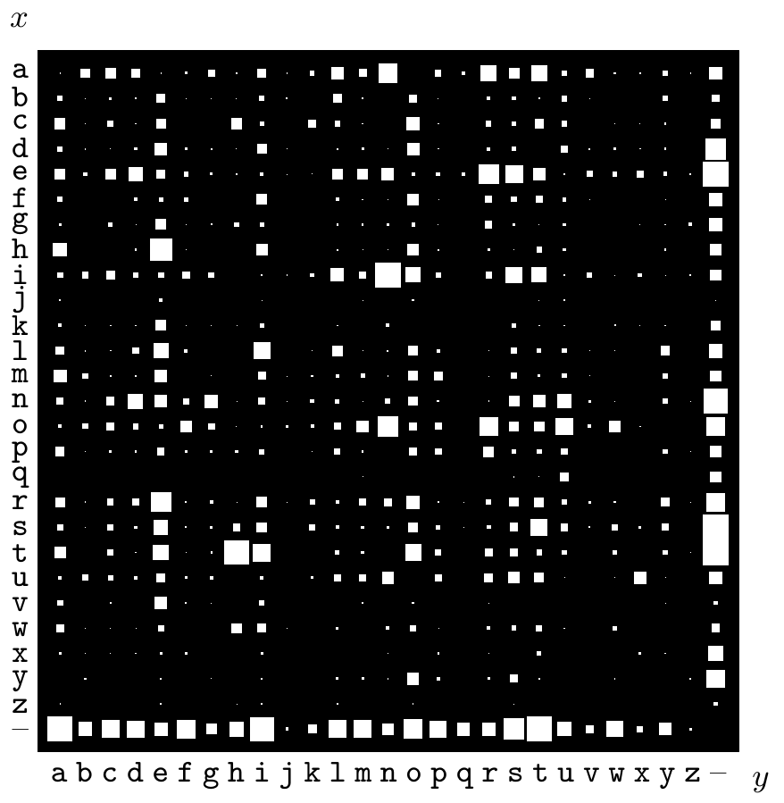

图 2.2　英语文档 *The Frequently Asked Questions Manual for Linux* 中，27×27 种可能的相邻字符对 $xy$ 的概率分布。纵轴 $x$ 是第一个字符，横轴 $y$ 是第二个字符；“–”表示空格，白色方块的面积表示概率。

**边缘概率。**对联合概率 $P(x,y)$ 求和，可以得到边缘概率 $P(x)$：

$$P(x=a_i)\equiv\sum_{y\in\mathcal A_Y}P(x=a_i,y).\tag{2.3}$$

类似地，使用较短的记号，$y$ 的边缘概率为

$$P(y)\equiv\sum_{x\in\mathcal A_X}P(x,y).\tag{2.4}$$

**条件概率**

$$P(x=a_i\mid y=b_j)\equiv\frac{P(x=a_i,y=b_j)}{P(y=b_j)}\quad\text{当 }P(y=b_j)\ne0.\tag{2.5}$$

［如果 $P(y=b_j)=0$，则 $P(x=a_i\mid y=b_j)$ 未定义。］

$P(x=a_i\mid y=b_j)$ 读作“在 $y$ 等于 $b_j$ 的条件下，$x$ 等于 $a_i$ 的概率”。

**例 2.1。**英语文档中连续两个字符构成的有序对 $XY$，就是一个联合系综。可能结果包括 `aa`、`ab`、`ac`、`zz` 等；我们可以预期 `ab` 和 `ac` 比 `aa` 和 `zz` 更常见。图 2.2 以图形展示了相邻两个字符的联合概率分布估计。

这个联合系综有一个特殊性质：两个边缘分布 $P(x)$ 和 $P(y)$ 完全相同，都等于图 2.1 所示的单字符分布。

从联合系综 $P(x,y)$ 出发，分别对各行和各列归一化，就能得到条件分布 $P(y\mid x)$ 和 $P(x\mid y)$（图 2.3）。$P(y\mid x=\mathrm q)$ 是第一个字符为 `q` 时第二个字符的概率分布。如图 2.3a 所示，此时第二个字符 $y$ 最可能取的两个值是
