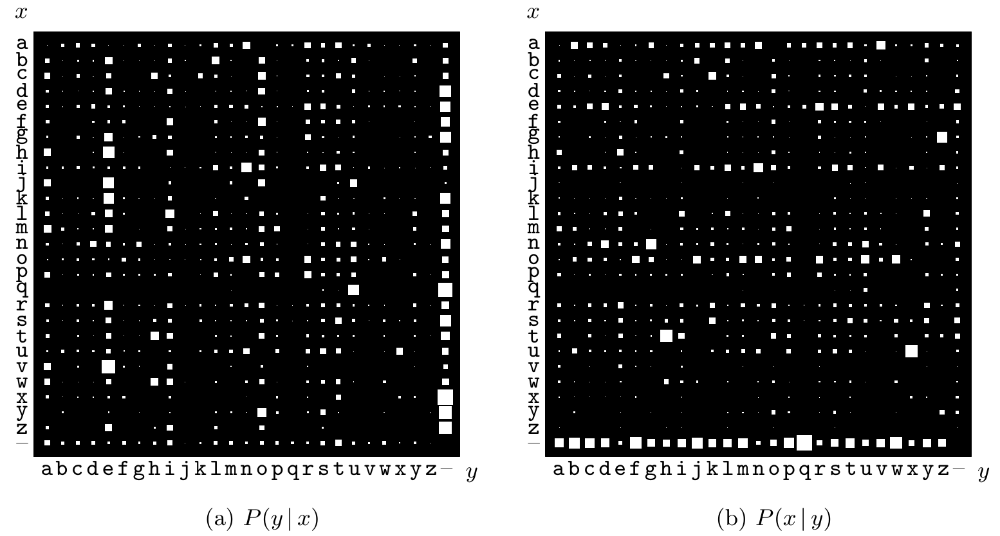

`u` 和空格。［`q` 后面常有空格，是因为作为数据来源的文档频繁使用单词 `FAQ`。］

图 2.3　条件概率分布。(a) $P(y\mid x)$：每一行表示在相邻字符对 $xy$ 中，已知第一个字符 $x$ 时第二个字符 $y$ 的条件分布。(b) $P(x\mid y)$：每一列表示已知第二个字符 $y$ 时，第一个字符 $x$ 的条件分布。图中“–”表示空格，白色方块的面积表示概率。

$P(x\mid y=\mathrm u)$ 是第二个字符为 `u` 时第一个字符的概率分布。从图 2.3b 可见，此时 $x$ 最可能取的两个值是 `n` 和 `o`。

定义一个系综时，我们常常不直接写出联合概率，而是给出一组条件概率。下面几条概率论规则会很有用。$\mathcal H$ 表示这些概率所依据的假设。

**乘法法则**——由条件概率的定义得到：

$$P(x,y\mid\mathcal H)=P(x\mid y,\mathcal H)P(y\mid\mathcal H)=P(y\mid x,\mathcal H)P(x\mid\mathcal H).\tag{2.6}$$

这条法则也称为**链式法则**。

**求和法则**——把边缘概率的定义改写为

$$P(x\mid\mathcal H)=\sum_y P(x,y\mid\mathcal H)\tag{2.7}$$

$$=\sum_y P(x\mid y,\mathcal H)P(y\mid\mathcal H).\tag{2.8}$$

**贝叶斯定理**——由乘法法则得到：

$$P(y\mid x,\mathcal H)=\frac{P(x\mid y,\mathcal H)P(y\mid\mathcal H)}{P(x\mid\mathcal H)}\tag{2.9}$$

$$=\frac{P(x\mid y,\mathcal H)P(y\mid\mathcal H)}{\sum_{y'}P(x\mid y',\mathcal H)P(y'\mid\mathcal H)}.\tag{2.10}$$

**独立性。**两个随机变量 $X$ 和 $Y$ 独立（有时写作 $X\perp Y$）当且仅当

$$P(x,y)=P(x)P(y).\tag{2.11}$$

**习题 2.2。**［1；解答见原书印刷第 40 页］图 2.2 的联合系综中，随机变量 $X$ 与 $Y$ 独立吗？
