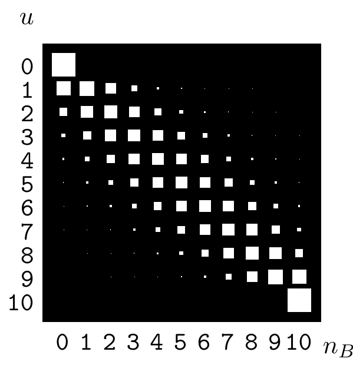
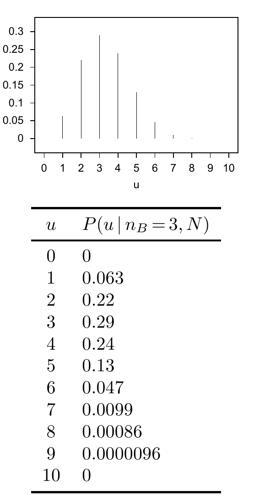

图 2.5　弗雷德与比尔的壶问题中，抽取 $N=10$ 次后，壶编号 $u$ 与黑球次数 $n_B$ 的联合概率。纵轴为 $u$，横轴为 $n_B$，白色方块面积表示概率。

对所有 $u$，边缘概率都是 $P(u)=1/11$。求解习题 2.4（原书印刷第 27 页）时，你已经写出已知 $u$ 和 $N$ 时 $n_B$ 的概率 $P(n_B\mid u,N)$。［你确实在做这些特别推荐的习题，对吧？］定义 $f_u\equiv u/10$，则

$$P(n_B\mid u,N)=\binom N{n_B}f_u^{n_B}(1-f_u)^{N-n_B}.\tag{2.23}$$

分母 $P(n_B\mid N)$ 又是什么？它是 $n_B$ 的边缘概率，可由求和法则得到：

$$P(n_B\mid N)=\sum_u P(u,n_B\mid N)=\sum_uP(u)P(n_B\mid u,N).\tag{2.24}$$

因此，给定 $n_B$ 时，$u$ 的条件概率为

$$P(u\mid n_B,N)=\frac{P(u)P(n_B\mid u,N)}{P(n_B\mid N)}\tag{2.25}$$

$$=\frac{1}{P(n_B\mid N)}\frac1{11}\binom N{n_B}f_u^{n_B}(1-f_u)^{N-n_B}.\tag{2.26}$$

把图 2.5 中 $n_B=3$ 对应的一列归一化，就得到图 2.6 所示的条件分布。归一化常数，即 $n_B$ 的边缘概率，是 $P(n_B=3\mid N=10)=0.083$。式（2.26）对所有 $u$ 都成立，包括端点 $u=0$ 和 $u=10$，此时 $f_u$ 分别为 0 和 1。给定 $n_B=3$，$u=0$ 的后验概率为零，因为从壶 0 不可能抽到任何黑球。$u=10$ 的后验概率也为零，因为那个壶里没有白球。其他假设 $u=1,2,\ldots,9$ 的后验概率都不为零。$\square$

图 2.6　在 $n_B=3$、$N=10$ 的条件下，壶编号 $u$ 的条件概率 $P(u\mid n_B=3,N)$。上方是概率图，下方依次列出 $u=0,1,\ldots,10$ 的每一个概率。

### 逆向概率的术语

在逆向概率题中，给贝叶斯定理中出现的各个概率命名很方便。在式（2.25）中，边缘概率 $P(u)$ 称为 $u$ 的**先验概率**，而 $P(n_B\mid u,N)$ 称为 $u$ 的**似然**。要注意，“似然”与“概率”并非同义词。$P(n_B\mid u,N)$ 同时是 $n_B$ 和 $u$ 的函数。固定 $u$ 时，它定义了 $n_B$ 上的概率分布；固定 $n_B$ 时，它定义了 $u$ 的似然。
