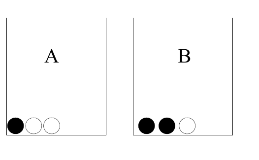
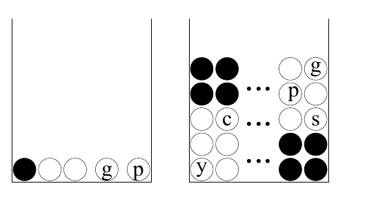

回看例 2.6（原书印刷第 27 页）和式（2.31），也可能有助于理解。

人们有时把“为 $f_H$ 这样的未知参数指定先验分布”误解为“先猜一个参数值”。但 $f_H$ 上的先验分布 $P(f_H)$，并不是“起初我猜 $f_H=1/2$”这样一句话。先验是 $f_H$ 上的概率密度，用来说明在观察数据前，我们认为 $f_H$ 落在任意区间 $(f,f+\delta f)$ 内的可能性。先验可能关于 $1/2$ 对称，因此在该先验下 $f_H$ 的均值为 $1/2$。这时，对第一次投掷结果 $x_1$ 的预测分布确实为

$$P(x_1=\text{正面})=\int\mathrm d f_H\,P(f_H)P(x_1=\text{正面}\mid f_H)=\int\mathrm d f_H\,P(f_H)f_H=1/2.\tag{2.33}$$

但对后续投掷的预测，取决于整个先验分布，而不只是它的均值。

### 数据压缩与逆向概率

考虑下面这项任务。

**例 2.9。**编写一个能够压缩如下二进制文件的计算机程序：

```text
0000000000000000000010010001000000100000010000000000000000000000000000000000001010000000000000110000
1000000000010000100000000010000000000000000000000100000000000000000100000000011000001000000011000100
0000000001001000000000010001000000000000000011000000000000000000000000000010000000000000000100000000
```

上面这串数据中有 $n_1=29$ 个 1 和 $n_0=271$ 个 0。

直观地说，压缩利用的是文件的可预测性。这里，产生该文件的源似乎更可能输出 0 而不是 1。压缩这个文件的程序，或明或暗都必须回答：“文件的下一个字符是 1 的概率是多少？”

你认为这个问题在性质上与例 2.7（原书印刷第 30 页）相似吗？我认为相似。本书的一个主题是：数据压缩和数据建模其实是一回事，而且都应像例 2.6 的壶问题一样，用逆向概率来处理。例 2.9 将在第 6 章解答。

### 似然原则

请解答下面两题。

**例 2.10。**壶 A 有三个球：一个黑球、两个白球；壶 B 也有三个球：两个黑球、一个白球。随机选取其中一个壶，抽出一个球，结果是黑球。选中壶 A 的概率是多少？



图 2.7　例 2.10 的两个壶。图内 A、B 分别为壶 A、壶 B；实心圆为黑球，空心圆为白球。

**例 2.11。**壶 A 有五个球：一个黑球、两个白球、一个绿球和一个粉红球；壶 B 有五百个球：二百个黑球、一百个白球、五十个黄球、四十个青球、三十个赭色球、二十五个绿球、二十五个银色球、二十个金色球、十个紫球。［壶 A 中五分之一的球是黑色的；壶 B 中五分之二的球是黑色的。］随机选取其中一个壶，抽出一个球，结果是黑球。选中壶 A 的概率是多少？



图 2.8　例 2.11 的两个壶。实心圆是黑球，空心圆是其他颜色的球，省略号表示未逐个画出的球。图内 A、B 是壶编号；`g` 表示绿，`c` 表示青，`y` 表示黄；`p` 在壶 A 中表示粉红，在壶 B 中表示紫。原图的 `s` 未区分名称都以 s 开头的赭色（sienna）和银色（silver）。
