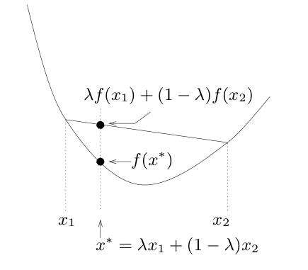
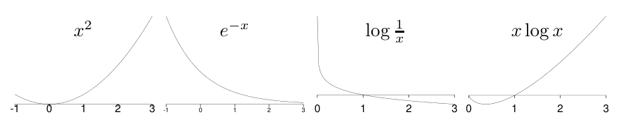
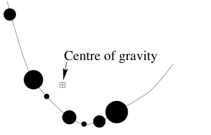

## 2.7 凸函数的詹森不等式

“凸 ⌣”（convex）和“凹 ⌢”（concave）也可以分别读成“凸笑脸”和“凹皱眉”。这种叫法多给了一条记忆线索：即使忘了“凸”和“凹”哪一个朝上，也不容易把笑脸和皱眉弄反。

### 凸函数

若函数 $f(x)$ 在区间 $(a,b)$ 上的任意一条弦都位于函数曲线之上，就称 $f(x)$ 在该区间上是**凸**的（图 2.10）。换言之，对所有 $x_1,x_2\in(a,b)$ 和 $0\leq\lambda\leq1$，都有

$$f(\lambda x_1+(1-\lambda)x_2)\leq\lambda f(x_1)+(1-\lambda)f(x_2).\tag{2.47}$$

图 2.10　凸性的定义。图中 $x^*=\lambda x_1+(1-\lambda)x_2$；弦上的值为 $\lambda f(x_1)+(1-\lambda)f(x_2)$，曲线上的值为 $f(x^*)$。

如果对所有 $x_1,x_2\in(a,b)$，等号只在 $\lambda=0$ 或 $\lambda=1$ 时成立，就称 $f$ 是**严格凸**的。凹函数与严格凹函数可作类似定义。

下面是一些严格凸的函数：

- 对所有 $x$，$x^2$、$e^x$ 和 $e^{-x}$；
- 对 $x>0$，$\log(1/x)$ 和 $x\log x$。

图 2.11　凸函数。四幅图自左至右分别为 $x^2$、$e^{-x}$、$\log(1/x)$ 和 $x\log x$。

### 詹森不等式

如果 $f$ 是凸函数，$x$ 是随机变量，那么

$$\mathbb E[f(x)]\geq f(\mathbb E[x]),\tag{2.48}$$

其中 $\mathbb E$ 表示期望。如果 $f$ 严格凸，且 $\mathbb E[f(x)]=f(\mathbb E[x])$，那么随机变量 $x$ 必为常量。对凹函数也可以写出詹森不等式，此时不等号方向相反。

可以用下面的力学图像来理解詹森不等式。

图内文字译注：“Centre of gravity”＝“重心”。

如果把质量为 $p_i$ 的物体放在凸曲线 $f(x)$ 上的 $(x_i,f(x_i))$ 处，那么这些物体的重心坐标为 $(\mathbb E[x],\mathbb E[f(x)])$，它位于曲线上方。

如果这个图像还不能使你信服，不妨做下面这道习题。

**习题 2.14**〔难度 2；解答见原书印刷页 41〕证明詹森不等式。

**例 2.15**　三个正方形的平均面积为 $\bar A=100\,\mathrm{m}^2$，平均边长为 $\bar l=10\,\mathrm m$。其中最大的正方形有多大？【使用詹森不等式。】

**解答。**设随机变量 $x$ 表示正方形的边长，它在三个边长 $l_1,l_2,l_3$ 上各取概率 $1/3$。已知 $\mathbb E[x]=10$，$\mathbb E[f(x)]=100$，其中 $f(x)=x^2$ 把边长映射为面积。这个函数严格凸。注意到 $\mathbb E[f(x)]=f(\mathbb E[x])$，因此 $x$ 必为常量，三个边长全都相等。最大的正方形面积就是 $100\,\mathrm{m}^2$。□
