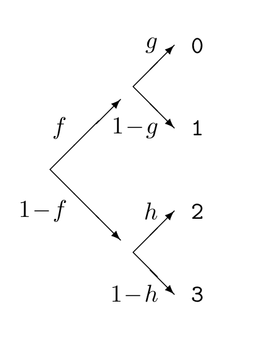

▷ **习题 2.28**〔难度 2；解答见原书印刷页 45〕随机变量 $x\in\{0,1,2,3\}$ 的值按如下方式选出：先抛一枚正面概率为 $f$ 的非均匀硬币，决定结果属于 $\{0,1\}$ 还是 $\{2,3\}$；然后分别抛第二枚正面概率为 $g$ 的非均匀硬币，或第三枚正面概率为 $h$ 的非均匀硬币。写出 $x$ 的概率分布。利用熵的可分解性 (2.44) 求 $X$ 的熵。［注意：使用二元熵函数 $H_2(x)$ 得到的表达式，比直接写出四项熵紧凑得多。］求 $H(X)$ 对 $f$ 的导数。［提示：$\mathrm dH_2(x)/\mathrm dx=\log((1-x)/x)$。］

习题 2.28 的分支示意：第一层分支概率为 $f$ 与 $1-f$；通向 $0,1$ 的第二层分支概率为 $g$ 与 $1-g$，通向 $2,3$ 的第二层分支概率为 $h$ 与 $1-h$。

▷ **习题 2.29**〔难度 2；解答见原书印刷页 45〕反复抛一枚均匀硬币，直到第一次出现正面为止。表示抛掷次数的随机变量 $x\in\{1,2,3,\ldots\}$ 的熵是多少？再计算非均匀硬币的情况，设每次出现正面的概率为 $f$。［提示：分别用直接计算和熵的可分解性 (2.43) 求解。］

## 2.9 补充习题

### 正向概率

▷ **习题 2.30**〔难度 1〕罐中有 $w$ 个白球和 $b$ 个黑球。连续取出两个球，不放回。证明第一次取到白球的概率等于第二次取到白球的概率。

▷ **习题 2.31**〔难度 2〕将一枚直径为 $a$ 的圆形硬币投到由边长为 $b$ 的正方形构成的方格上，$a<b$。硬币完全落在同一个方格内的概率是多少？［答案：$(1-a/b)^2$。］

▷ **习题 2.32**〔难度 3〕**布丰投针问题。** 将一根长度为 $a$ 的针投到画有等间距平行线的平面上，线间距为 $b$。针与一条线相交的概率是多少？［若 $a<b$，答案为 $2a/(\pi b)$。］［推广——布丰投曲线问题（Buffon's noodle）：长度为 $A$ 的随机曲线与这些线相交的次数，平均为 $2A/(\pi b)$。］

**习题 2.33**〔难度 2〕在一条长度为 $1$ 的线段上随机选取两个点。这两个点将线段分成三段。用这三段构成三角形的概率是多少？

**习题 2.34**〔难度 2；解答见原书印刷页 45〕反复抛一枚均匀硬币，直到第一次出现正面为止。反面的期望次数和正面的期望次数分别是多少？弗雷德不知道这枚硬币是均匀的，他用 $\hat f\equiv h/(h+t)$ 估计它的正面概率，其中 $h$ 和 $t$ 分别是抛出的正面和反面次数。计算 $\hat f$ 的概率分布，并画出示意图。

注意：这是正向概率问题，也就是抽样理论问题，而不是推断问题。不要使用贝叶斯定理。

 **习题 2.35**〔难度 2；解答见原书印刷页 45〕弗雷德每秒掷一次均匀的六面骰子，记下掷出六点的时刻。

(a) 从一次六点到下一次六点，平均要掷多少次？

(b) 在相邻两次掷骰之间，钟敲了一下。从钟响起到下一次六点，平均要掷多少次？
