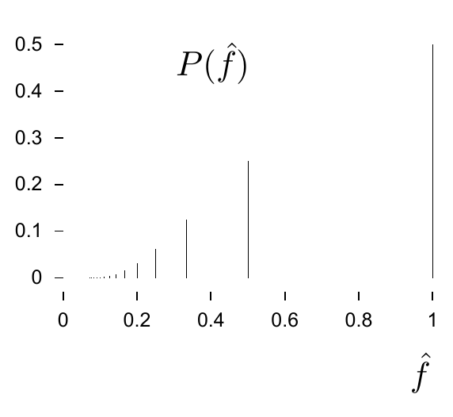

**习题 2.28 的解答（原书印刷页 38）。**

$$H(X)=H_2(f)+fH_2(g)+(1-f)H_2(h).\tag{2.99}$$

**习题 2.29 的解答（原书印刷页 38）。** 先出现 $x-1$ 次反面，再出现一次正面，即第 $x$ 次抛掷首次出现正面的概率为

$$P(x)=(1-f)^{x-1}f.\tag{2.100}$$

若第一次抛出反面，此后各次抛掷的概率分布就与第一次抛掷之前相同。因此熵满足递归关系

$$H(X)=H_2(f)+(1-f)H(X).\tag{2.101}$$

整理后得到

$$H(X)=\frac{H_2(f)}f.\tag{2.102}$$

**习题 2.34 的解答（原书印刷页 38）。** 反面次数为 $t$ 的概率是

$$P(t)=\left(\frac12\right)^t\frac12,\qquad t\geq0.\tag{2.103}$$

根据题意，正面的期望次数为 $1$。反面的期望次数为

$$\mathbb E[t]=\sum_{t=0}^{\infty}t\left(\frac12\right)^t\frac12,\tag{2.104}$$

可以用多种方法证明它等于 $1$。例如，抛出一次反面后，问题便回到起始状态，因此可写出递归关系

$$\mathbb E[t]=\frac12\bigl(1+\mathbb E[t]\bigr)+\frac12\times0
\quad\Rightarrow\quad\mathbb E[t]=1.\tag{2.105}$$

图 2.12 画出真实正面概率为 $f=1/2$ 时，“估计量” $\hat f=1/(1+t)$ 的概率分布。$\hat f$ 取某个值的概率，就是对应的 $t$ 值的概率。

图 2.12　真实正面概率为 $f=1/2$ 时，估计量 $\hat f=1/(1+t)$ 的概率分布。图中横轴为 $\hat f$，纵轴为 $P(\hat f)$。

**习题 2.35 的解答（原书印刷页 38）。**

(a) 从一次六点到下一次六点，平均掷骰次数为六次（从前一次六点之后开始计数）。下一次六点出现在第 $r$ 次掷骰的概率，等于前 $r-1$ 次均未掷出六点的概率，乘以随后掷出六点的概率：

$$P(r_1=r)=\left(\frac56\right)^{r-1}\frac16,
\qquad r\in\{1,2,3,\ldots\}.\tag{2.106}$$

这种关于掷骰次数 $r$ 的概率分布可以称为指数分布，因为

$$P(r_1=r)=\frac{e^{-\alpha r}}Z,\tag{2.107}$$

其中 $\alpha=\ln(6/5)$，$Z$ 是归一化常数。

(b) 从钟响时刻到下一次六点，平均掷骰次数为六次。

(c) 从钟响时刻往回追溯到最近一次六点，平均掷骰次数也是六次。
