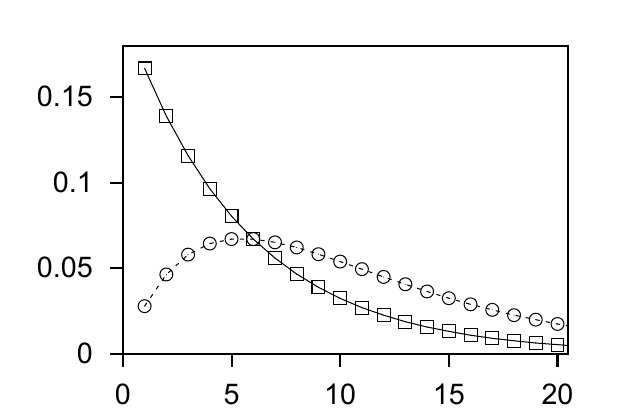

(d) 从钟响之前的那次六点到钟响之后的下一次六点，平均掷骰次数等于 (b) 与 (c) 的答案之和减一，即十一次。

(e) 这里再给出一条提示，以帮助理解 (a) 与 (d) 的差异。设想泊松镇的公交车相互独立地随机到站（构成泊松过程），平均每六分钟来一辆。乘客以均匀的速率到达各车站，公交车一到站便立刻接走乘客，因此两车之间的时间间隔不会因上客而改变。凡是跟在超过六分钟的空档之后到来的公交车，都会过度拥挤。乘客代表抱怨说，三分之二的乘客坐上了过度拥挤的车。公交公司却说：“不对，不对，只有三分之一的车过度拥挤。”这两种说法能同时成立吗？

图 2.13　从一次六点到下一次六点的掷骰次数 $r_1$ 的概率分布为实线下降曲线：$P(r_1=r)=(5/6)^{r-1}(1/6)$。从下午一点之前的那次六点到此后的下一次六点，掷骰总次数 $r_{\mathrm{tot}}$ 的分布为虚线曲线：$P(r_{\mathrm{tot}}=r)=r(5/6)^{r-1}(1/6)^2$。$P(r_1>6)$ 约为 $1/3$，而 $P(r_{\mathrm{tot}}>6)$ 约为 $2/3$；$r_1$ 的均值为 $6$，$r_{\mathrm{tot}}$ 的均值为 $11$。

**习题 2.38 的解答（原书印刷页 39）。**

**二项分布法。** 根据习题 1.2 的解答，错误概率为 $p_B=3f^2(1-f)+f^3$。

**求和法。** 对 $\mathbf r$ 的八种取值，下面两式给出了边缘概率的代表性情形：

$$P(\mathbf r=000)=\frac12(1-f)^3+\frac12f^3,\tag{2.108}$$

$$P(\mathbf r=001)=\frac12f(1-f)^2+\frac12f^2(1-f)=\frac12f(1-f).\tag{2.109}$$

后验概率的代表性情形为

$$P(s=1\mid\mathbf r=000)=\frac{f^3}{(1-f)^3+f^3},\tag{2.110}$$

以及

$$P(s=1\mid\mathbf r=001)
=\frac{(1-f)f^2}{f(1-f)^2+f^2(1-f)}=f.\tag{2.111}$$

因此，这两种代表性接收结果所对应的错误概率分别为

$$P(\mathrm{error}\mid\mathbf r=000)=\frac{f^3}{(1-f)^3+f^3},\tag{2.112}$$

以及

$$P(\mathrm{error}\mid\mathbf r=001)=f.\tag{2.113}$$

注意，虽然 $R_3$ 的平均错误概率约为 $3f^2$，但给定具体的 $\mathbf r$ 后，该比特出错的概率要么约为 $f^3$，要么约为 $f$。

使用求和法则，平均错误概率为

$$\begin{aligned}
P(\mathrm{error})
&=\sum_{\mathbf r}P(\mathbf r)P(\mathrm{error}\mid\mathbf r)\\
&=2\left[\frac12(1-f)^3+\frac12f^3\right]
\frac{f^3}{(1-f)^3+f^3}\\
&\quad+6\left[\frac12f(1-f)\right]f.
\end{aligned}$$

第一项中的系数 $2$ 对应 $\mathbf r=000$ 和 $111$；其余六种结果具有相同的出现概率和相同的错误概率 $f$。因此，

$$P(\mathrm{error})=f^3+3f^2(1-f).$$

**习题 2.39 的解答（原书印刷页 40）。** 每个单词的熵为 $9.7$ 比特。
