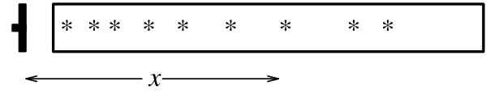

# 关于第 3 章

如果你迫不及待地想学习信息论、数据压缩和有噪声信道，可以先跳到第 4 章。不过，数据压缩与数据建模密切相关；因此，读到第 6 章时，你大概会想回来读这一章。在阅读第 3 章之前，先看一看下面的习题也许不错。

▷ **习题 3.1**〔难度 2；解答见原书印刷页 59〕从两枚二十面骰子中随机选一枚。骰子各面标有数字 1–10，但每个数字出现的次数并不相同：

| 数字 | 1 | 2 | 3 | 4 | 5 | 6 | 7 | 8 | 9 | 10 |
| --- | ---: | ---: | ---: | ---: | ---: | ---: | ---: | ---: | ---: | ---: |
| 骰子 A 上标有该数字的面数 | 6 | 4 | 3 | 2 | 1 | 1 | 1 | 1 | 1 | 0 |
| 骰子 B 上标有该数字的面数 | 3 | 3 | 2 | 2 | 2 | 2 | 2 | 2 | 1 | 1 |

将随机选出的骰子掷 7 次，结果依次为：$5,3,9,3,8,4,7$。选中的骰子是 A 的概率是多少？

▷ **习题 3.2**〔难度 2；解答见原书印刷页 59〕假设还有第三枚二十面骰子 C，数字 1–20 在它的各面上各出现一次。与上题一样，从三枚骰子中随机选一枚并掷 7 次，结果依次为：$3,5,4,8,3,9,7$。所选骰子分别是 (a) A、(b) B、(c) C 的概率是多少？

 **习题 3.3**〔难度 3；解答见原书印刷页 48〕**推断衰变常数。**不稳定粒子从一个源发出，在距离 $x$ 处衰变；$x$ 是服从指数概率分布的实数，该分布的特征长度为 $\lambda$。只有发生在 $x=1\,\mathrm{cm}$ 到 $x=20\,\mathrm{cm}$ 的窗口内的衰变事件才能被观测到。在位置 $\{x_1,\ldots,x_N\}$ 观测到 $N$ 次衰变。$\lambda$ 是多少？

图内星号表示窗口中观测到的衰变位置；$x$ 表示距粒子源的距离。

▷ **习题 3.4**〔难度 3；解答见原书印刷页 55〕**法庭证据。**两个人在犯罪现场留下了各自的血迹。嫌疑人奥利弗接受检测，血型为 O 型。现场两处血迹分别为 O 型（当地人口中常见，频率为 60%）和 AB 型（罕见，频率为 1%）。这些数据（现场发现 O 型和 AB 型血）是否支持“奥利弗是到过现场的两个人之一”这个命题？
