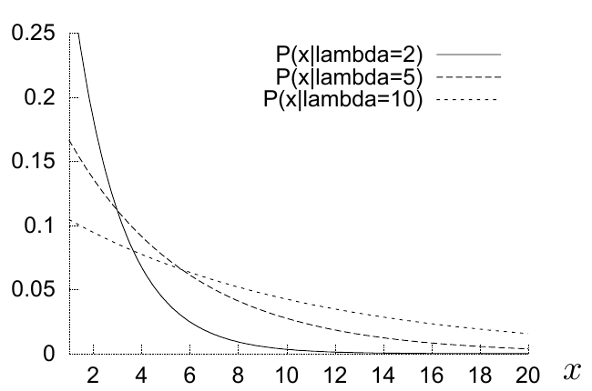
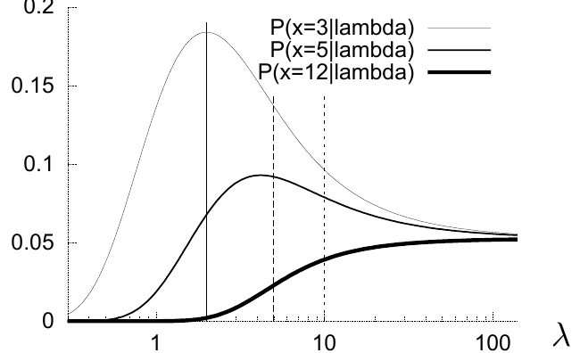
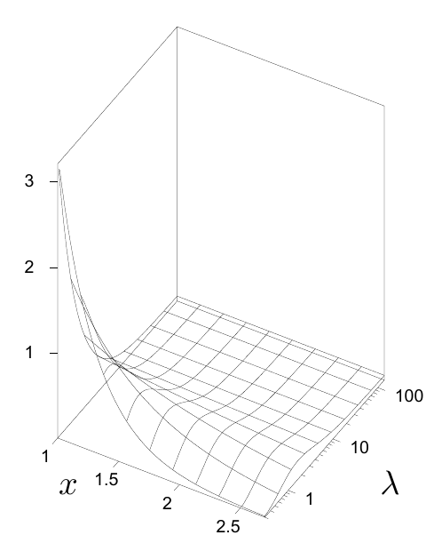
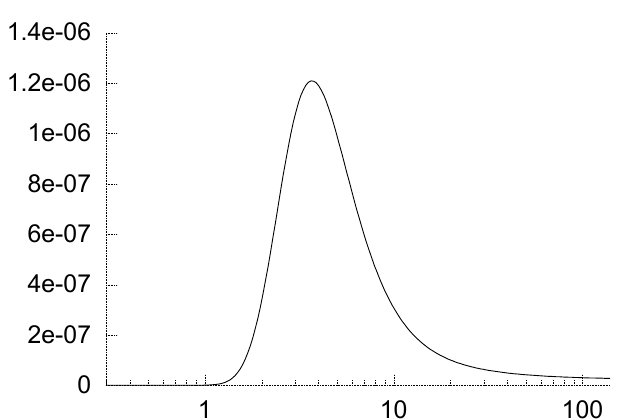

图 3.1　概率密度 $P(x\mid\lambda)$ 随 $x$ 的变化。实线、虚线、点线分别对应 $\lambda=2,5,10$。

图 3.2　取三个不同的 $x$ 值时，概率密度 $P(x\mid\lambda)$ 随 $\lambda$ 的变化。按这种方式作图，该函数称为 $\lambda$ 的**似然**。由细到粗的三条曲线分别对应 $x=3,5,12$；实线、虚线、点线竖线分别标出上一幅图使用的 $\lambda=2,5,10$。

史蒂夫写下已知 $\lambda$ 时一个数据点的概率：

$$P(x\mid\lambda)=
\begin{cases}
\dfrac{1}{\lambda}\,e^{-x/\lambda}/Z(\lambda),&1<x<20,\\
0,&\text{其他情况},
\end{cases}\tag{3.1}$$

其中

$$Z(\lambda)=\int_1^{20}\!\mathrm dx\,\frac1\lambda e^{-x/\lambda}
=e^{-1/\lambda}-e^{-20/\lambda}.\tag{3.2}$$

这看起来很自然。随后，他写出贝叶斯定理：

$$P(\lambda\mid\{x_1,\ldots,x_N\})
=\frac{P(\{x\}\mid\lambda)P(\lambda)}{P(\{x\})},\tag{3.3}$$

$$P(\lambda\mid\{x_1,\ldots,x_N\})
\propto\frac1{(\lambda Z(\lambda))^N}
\exp\!\left(-\sum_{n=1}^{N}\frac{x_n}{\lambda}\right)P(\lambda).\tag{3.4}$$

突然之间，原本直接给出“已知假设 $\lambda$ 时数据有多大概率”的分布 $P(\{x_1,\ldots,x_N\}\mid\lambda)$，被反过来用于定义“已知数据时假设有多大概率”。图 3.1 把单个数据点的概率 $P(x\mid\lambda)$ 画成 $x$ 的常见函数，并分别选取几个 $\lambda$ 值。每条曲线都是一条面积归一为 $1$ 的指数曲线。固定 $x$，将同一个函数画成 $\lambda$ 的函数，便会发生引人注意的变化：曲线出现峰值（图 3.2）。为了理解观察同一函数的这两种角度，图 3.3 把 $P(x\mid\lambda)$ 画成关于 $x$ 和 $\lambda$ 的曲面。

图 3.3　概率密度 $P(x\mid\lambda)$ 关于 $x$ 和 $\lambda$ 的曲面。图 3.1 与图 3.2 是这个曲面的垂直截面。

如果数据集包含多个点，例如 $\{x_n\}_{n=1}^{N}=\{1.5,2,3,4,5,12\}$ 这六个点，则似然函数 $P(\{x\}\mid\lambda)$ 是 $N$ 个关于 $\lambda$ 的函数 $P(x_n\mid\lambda)$ 的乘积（图 3.4）。

图 3.4　包含六个点的数据集对应的似然函数 $P(\{x\}=\{1.5,2,3,4,5,12\}\mid\lambda)$，画为 $\lambda$ 的函数。
