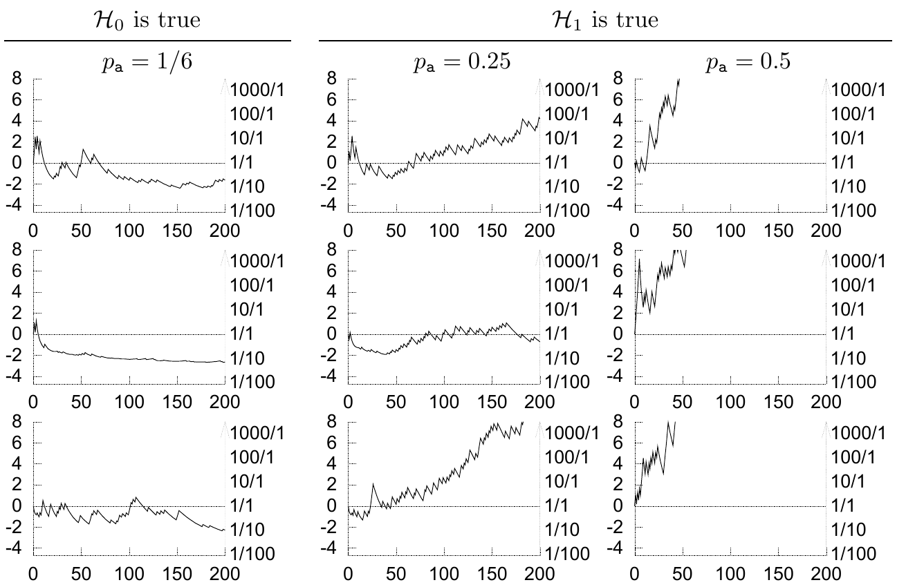

**表 3.5**　“非均匀硬币”的模型 $\mathcal H_1$ 与 $\mathcal H_0$ 的比较结果。模型 $\mathcal H_0$ 规定 $p_{\mathrm a}=1/6$、$p_{\mathrm b}=5/6$。

| $F$ | 数据 $(F_{\mathrm a},F_{\mathrm b})$ | $P(\mathcal H_1\mid\mathbf s,F)/P(\mathcal H_0\mid\mathbf s,F)$ | 等价比值 |
|---:|:---:|---:|:---:|
| 6 | $(5,1)$ | $222.2$ |  |
| 6 | $(3,3)$ | $2.67$ |  |
| 6 | $(2,4)$ | $0.71$ | $1/1.4$ |
| 6 | $(1,5)$ | $0.356$ | $1/2.8$ |
| 6 | $(0,6)$ | $0.427$ | $1/2.3$ |
| 20 | $(10,10)$ | $96.5$ |  |
| 20 | $(3,17)$ | $0.2$ | $1/5$ |
| 20 | $(0,20)$ | $1.83$ |  |

图 3.6　在三种不同条件（从左到右三列）下，随着抛掷次数增加，支持 $\mathcal H_1$ 的证据的典型变化。横轴是抛掷次数 $F$；左侧纵轴是 $\ln[P(\mathbf s\mid F,\mathcal H_1)/P(\mathbf s\mid F,\mathcal H_0)]$，右侧纵轴是对应的证据比。上方文字“$\mathcal H_0$ 成立”对应左列，$p_{\mathrm a}=1/6$；“$\mathcal H_1$ 成立”对应中、右列，$p_{\mathrm a}$ 分别为 $0.25$ 和 $0.5$。三行是彼此独立的模拟实验。（另见图 3.8，原书印刷页 60。）

▷ **习题 3.6**〔难度 2〕证明：抛掷 $F$ 次后，对数证据比

$$\log\frac{P(\mathbf s\mid F,\mathcal H_1)}{P(\mathbf s\mid F,\mathcal H_0)}\tag{3.23}$$

在支持 $\mathcal H_1$ 时可达到的最大值随 $F$ 线性增长；而支持 $\mathcal H_0$ 的对数证据最多只能以 $\log F$ 的速度增长。

▷ **习题 3.7**〔难度 3；解答见原书印刷页 60〕从抽样理论的角度出发，假设尚未测得 $F_{\mathrm a}$，计算对数证据比可能落入的一个合理范围，将其表示为 $F$ 和 $p_{\mathrm a}$ 真实值的函数，并分别在 $p_{\mathrm a}=p_0=1/6$、$p_{\mathrm a}=0.25$、$p_{\mathrm a}=1/2$ 时，画出这个范围随 $F$ 的变化。［提示：把对数证据画成随机变量 $F_{\mathrm a}$ 的函数，求出 $F_{\mathrm a}$ 的均值与标准差。］

### 证据的典型变化

图 3.6 显示了若干模拟实验中，对数证据比随抛掷次数 $F$ 的变化。左列实验中 $\mathcal H_0$ 为真；右边两列中 $\mathcal H_1$ 为真，$p_{\mathrm a}$ 分别为 $0.25$ 或 $0.5$。

后面的章节会进一步讨论模型比较。
