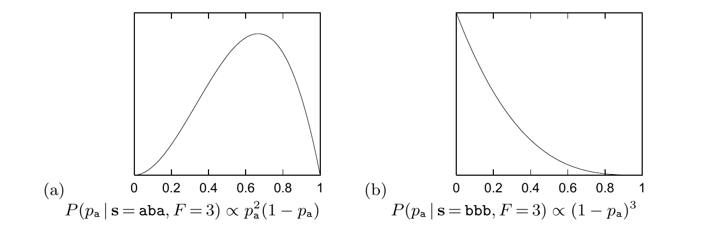

指着其中一枚说：“看，这枚是正面，我赢了。”另一枚硬币也是正面的概率是多少？

▷ **习题 3.15**〔难度 2；解答见原书印刷页 63〕2002 年 1 月 4 日星期五，《卫报》（*The Guardian*）刊登了一项统计说法：

> 一枚比利时的一欧元硬币被竖起来旋转 250 次，结果出现正面 140 次、反面 110 次。“我觉得很可疑，”伦敦政治经济学院的统计学讲师巴里·布莱特（Barry Blight）说，“如果硬币没有偏向，得到这样极端的结果的概率将小于 $7\%$。”

但这些数据是否支持“硬币有偏向”，而不是“硬币公平”？［提示：参见式 (3.22)。］

## 3.6 解答

**习题 3.1 的解答（原书印刷页 47）。** 把数据记为 $D$。假设两枚骰子的先验概率相等，

$$\frac{P(A\mid D)}{P(B\mid D)}
=\frac{1\cdot3\cdot1\cdot3\cdot1\cdot2\cdot1}{2\cdot2\cdot1\cdot2\cdot2\cdot2\cdot2}
=\frac9{32}.\tag{3.31}$$

所以 $P(A\mid D)=9/41$。

**习题 3.2 的解答（原书印刷页 47）。** 在每一种假设下，数据出现的概率分别为

$$P(D\mid A)=\frac3{20}\frac1{20}\frac2{20}\frac1{20}\frac3{20}\frac1{20}\frac1{20}
=\frac{18}{20^7},\tag{3.32}$$

$$P(D\mid B)=\frac2{20}\frac2{20}\frac2{20}\frac2{20}\frac2{20}\frac1{20}\frac2{20}
=\frac{64}{20^7},\tag{3.33}$$

$$P(D\mid C)=\frac1{20}\frac1{20}\frac1{20}\frac1{20}\frac1{20}\frac1{20}\frac1{20}
=\frac1{20^7}.\tag{3.34}$$

因此，

$$P(A\mid D)=\frac{18}{18+64+1}=\frac{18}{83};\qquad
P(B\mid D)=\frac{64}{83};\qquad
P(C\mid D)=\frac1{83}.\tag{3.35}$$

图 3.7　给定两组不同数据时，非均匀硬币的正面概率 $p_{\mathrm a}$ 的后验分布。(a) $P(p_{\mathrm a}\mid\mathbf s=\mathrm{aba},F=3)\propto p_{\mathrm a}^2(1-p_{\mathrm a})$；(b) $P(p_{\mathrm a}\mid\mathbf s=\mathrm{bbb},F=3)\propto(1-p_{\mathrm a})^3$。

**习题 3.5 的解答（原书印刷页 52）。**

(a) $P(p_{\mathrm a}\mid\mathbf s=\mathrm{aba},F=3)\propto p_{\mathrm a}^2(1-p_{\mathrm a})$。$p_{\mathrm a}$ 的最可能值，即令后验概率密度最大的值，为 $2/3$；它的均值为 $3/5$。见图 3.7a。
