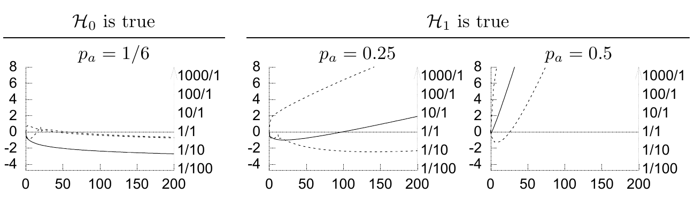

(b) $P(p_{\mathrm a}\mid\mathbf s=\mathrm{bbb},F=3)\propto(1-p_{\mathrm a})^3$。$p_{\mathrm a}$ 的最可能值，即令后验概率密度最大的值，为 $0$；它的均值为 $1/5$。见图 3.7b。

图 3.8　支持 $\mathcal H_1$ 的对数证据随抛掷次数 $F$ 变化时，合理取值的范围。左侧纵轴是 $\log[P(\mathbf s\mid F,\mathcal H_1)/P(\mathbf s\mid F,\mathcal H_0)]$，右侧纵轴是对应的证据比。上方文字表示左列中 $\mathcal H_0$ 成立且 $p_{\mathrm a}=1/6$，中、右列中 $\mathcal H_1$ 成立且 $p_{\mathrm a}$ 分别为 $0.25$ 和 $0.5$。实线表示随机变量 $F_{\mathrm a}$ 取其均值 $p_{\mathrm a}F$ 时的对数证据；虚线表示 $F_{\mathrm a}$ 约处于其第 $2.5$ 或第 $97.5$ 百分位时的对数证据。（另见图 3.6，原书印刷页 54。）

**习题 3.7 的解答（原书印刷页 54）。** 计算图 3.8 中的曲线时，先求出 $F_{\mathrm a}$ 的均值与标准差；再将 $F_{\mathrm a}$ 设为均值加、减两个标准差，得到其大致的 $95\%$ 合理范围；最后分别计算由此得到的三个对数证据比。

**习题 3.8 的解答（原书印刷页 57）。** 设 $\mathcal H_i$ 表示“奖品在 $i$ 号门后”。我们作如下假设：三个假设 $\mathcal H_1$、$\mathcal H_2$ 和 $\mathcal H_3$ 的先验概率相同，即

$$P(\mathcal H_1)=P(\mathcal H_2)=P(\mathcal H_3)=\frac13.\tag{3.36}$$

选了 1 号门之后，我们接收到的数据是 $D=3$ 或 $D=2$，分别表示 3 号门或 2 号门被打开。假设这两种可能结果的概率如下：如果奖品在 1 号门后，主持人可以自由选择开哪一扇门；此时假定他随机选择 $D=2$ 或 $D=3$。否则，主持人只能开指定的一扇门，相应的概率分别为 $0$ 和 $1$。

$$\begin{array}{lll}
P(D=2\mid\mathcal H_1)=1/2,&P(D=2\mid\mathcal H_2)=0,&P(D=2\mid\mathcal H_3)=1,\\
P(D=3\mid\mathcal H_1)=1/2,&P(D=3\mid\mathcal H_2)=1,&P(D=3\mid\mathcal H_3)=0.
\end{array}\tag{3.37}$$

现在用贝叶斯定理计算这些假设的后验概率：

$$P(\mathcal H_i\mid D=3)
=\frac{P(D=3\mid\mathcal H_i)P(\mathcal H_i)}{P(D=3)},\tag{3.38}$$

$$\begin{aligned}
P(\mathcal H_1\mid D=3)&=\frac{(1/2)(1/3)}{P(D=3)},\\
P(\mathcal H_2\mid D=3)&=\frac{(1)(1/3)}{P(D=3)},\\
P(\mathcal H_3\mid D=3)&=\frac{(0)(1/3)}{P(D=3)}.
\end{aligned}\tag{3.39}$$

分母 $P(D=3)=1/2$，因为它是这一后验分布的归一化常数。因此，

$$P(\mathcal H_1\mid D=3)=\frac13,\qquad
P(\mathcal H_2\mid D=3)=\frac23,\qquad
P(\mathcal H_3\mid D=3)=0.\tag{3.40}$$

所以，参赛者应换选 2 号门，这样赢得奖品的机会最大。

很多人觉得这个结果出人意料。有两种方法能使它更容易理解。一种是和朋友把游戏玩三十次，记录换门时赢得奖品的频率。另一种是做一个思想实验：游戏改为有一百万扇门。此时规则是，参赛者先选一扇门，然后主持人
