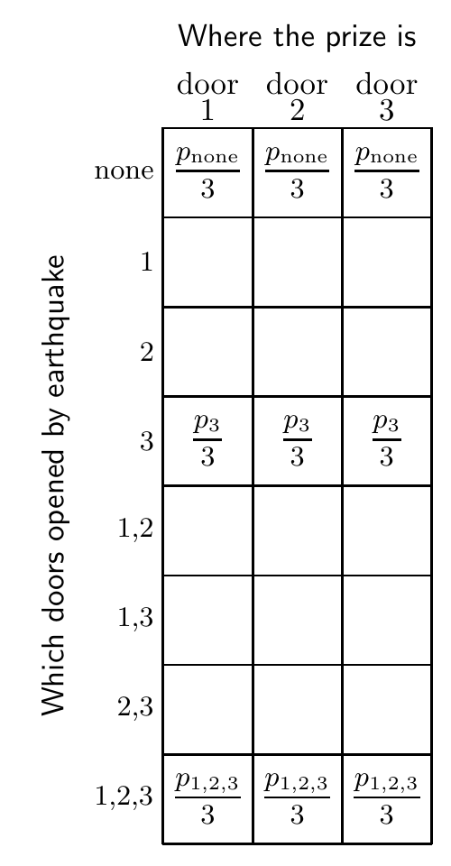

打开另外 999,998 扇门，确保不露出奖品，只留下参赛者先前选中的那扇门和另一扇门关着。参赛者这时可以坚持原选，也可以换门。设想面对一百万扇门时，只有 1 号和 234,598 号门还关着，1 号门是参赛者最初猜的。你觉得奖品在哪里？

**习题 3.9 的解答（原书印刷页 57）。** 如果 3 号门是被地震震开的，推断结果就不同了，尽管眼前的场面看起来一样。数据的性质及数据出现的概率，现在都不同了。首先，可能打开任意数量的门。我们可以用 $\mathbf d=(0,0,0),(0,0,1),(0,1,0),(1,0,0),(0,1,1),\ldots,(1,1,1)$ 表示八种可能结果。其次，地震打开一扇或多扇门后，奖品可能被看见。因此，数据 $D$ 包括 $\mathbf d$ 的取值，以及奖品是否露出的信息。很难说这些结果各自的概率是多少，因为它们取决于我们对门闩可靠程度和地震特性的判断。但无须给每个 $\mathbf d$ 的 $P(\mathbf d\mid\mathcal H_i)$ 指定数值，仍可求出想要的后验概率。重要的只是实际发生的 $D$ 对应的 $P(D\mid\mathcal H_1)$、$P(D\mid\mathcal H_2)$、$P(D\mid\mathcal H_3)$ 三者的相对大小。［这就是第 2.3 节介绍的似然原则。］实际发生的数据是“$\mathbf d=(0,0,1)$，且看不到奖品”。首先显然有 $P(D\mid\mathcal H_3)=0$，因为看不到奖品与奖品在 3 号门后不相容。现在假定参赛者选了 1 号门，$P(D\mid\mathcal H_1)$ 与 $P(D\mid\mathcal H_2)$ 如何比较？如果地震不受参赛者选择的影响，那么根据对称性，两者必定相等。我们不知道 3 号门从门轴上脱落的概率是多少；但无论这个概率是多少，奖品在 1 号门后或 2 号门后，都同样可能发生这件事。

因此，若 $P(D\mid\mathcal H_1)=P(D\mid\mathcal H_2)$，则

$$\begin{aligned}
P(\mathcal H_1\mid D)
&=\frac{P(D\mid\mathcal H_1)(1/3)}{P(D)}=\frac12,\\
P(\mathcal H_2\mid D)
&=\frac{P(D\mid\mathcal H_2)(1/3)}{P(D)}=\frac12,\\
P(\mathcal H_3\mid D)
&=\frac{P(D\mid\mathcal H_3)(1/3)}{P(D)}=0.
\end{aligned}\tag{3.41}$$

剩下两个可能的假设现在概率相同。

如果假设主持人知道奖品在哪里，而且可能有意误导，那么答案还可能进一步改变，因为此时必须把主持人说的话也视作数据的一部分。

糊涂了吗？务必把这两道游戏节目题真正弄懂。别担心，我第一次遇到第二题时也犯过错。

处理令人困惑的概率题，有一条很有帮助的通则：

> 写出**所有事情**的概率。——史蒂夫·古尔

从这个联合概率出发，就能按步骤求出任何需要的推断（图 3.9）。

图 3.9　第二道三扇门题中，刚发生地震后的“所有事情”的概率。图内列标题“Where the prize is”意为“奖品所在的门”，三列对应 1、2、3 号门；行标题“Which doors opened by earthquake”意为“地震打开了哪些门”，“none”意为“一扇也没打开”，其余行列出被打开门的编号。$p_3$ 表示地震仅打开 3 号门的概率；图中还列出 $p_{\mathrm{none}}$ 和 $p_{1,2,3}$ 对应的联合概率。每格除以 $3$，对应三种奖品位置的先验概率均为 $1/3$；原图空白格未指定概率。

**习题 3.11 的解答（原书印刷页 58）。** 律师引用的统计数字，说明随机选中的一名殴打妻子的男子后来杀害妻子的概率。妻子**已经遇害**这一条件下，丈夫是凶手的概率，是完全不同的量。
