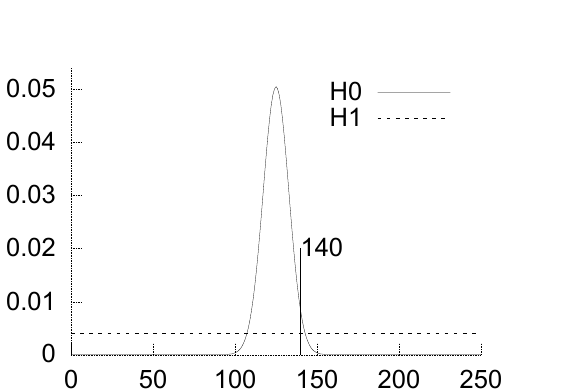

$0.1$。无论如何，$\alpha$ 应在 $0.1$ 到 $1$ 之间。我们可以把这一概率的不确定性继续带入推断，看看它最终有多大影响。

拨打有效号码时听到占线信号的概率 $\beta$，等于你认为在试拨时处于通话中或听筒未挂回状态的电话所占比例。这个比例因城市和一天中的时刻而异。在剑桥，我猜白天约有 $1\%$ 的电话正在使用；凌晨 4 点，也许只有 $0.1\%$，甚至更少。

概率 $P(D\mid\mathcal H_1)$ 是 $\alpha$ 与 $\beta$ 的乘积，即约 $0.1\times0.01=10^{-3}$。据此估计，拨打一个随机号码却听到占线信号的概率约为千分之一；如果有效号码高度集中，则约为百分之一；如果在深夜拨打，则约为万分之一。

这些数据怎样改变你对自己电话号码的看法？后验概率比等于似然比乘以先验概率比：

$$\frac{P(\mathcal H_0\mid D)}{P(\mathcal H_1\mid D)}
=\frac{P(D\mid\mathcal H_0)}{P(D\mid\mathcal H_1)}
\frac{P(\mathcal H_0)}{P(\mathcal H_1)}.\tag{3.43}$$

似然比约为 $100:1$ 或 $1000:1$，因此后验概率比向 $\mathcal H_0$ 倾斜了 $100$ 倍或 $1000$ 倍。如果 $\mathcal H_0$ 的先验概率为 $0.5$，那么其后验概率为

$$P(\mathcal H_0\mid D)
=\frac1{1+P(\mathcal H_1\mid D)/P(\mathcal H_0\mid D)}
\simeq0.99\ \text{或}\ 0.999.\tag{3.44}$$

**习题 3.15 的解答（原书印刷页 59）。** 比较两个模型：$\mathcal H_0$ 表示硬币公平；$\mathcal H_1$ 表示硬币有偏向，其偏向程度采用均匀先验 $P(p\mid\mathcal H_1)=1$。［我觉得采用均匀先验有道理，因为我知道有些硬币——例如美国一美分硬币——竖起来旋转时会有很严重的偏向；所以 $p=0.01$、$p=0.1$ 或 $p=0.95$ 这样的情形并不会令我意外。］

> 当我说 $\mathcal H_0$“硬币公平”时，较真的人可能会说：“居然考虑硬币完全公平，这太荒唐了——任何硬币总会有一点偏向。”我当然同意。因此请这些较真的读者把 $\mathcal H_0$ 理解为“硬币的公平程度在千分之一之内”，即 $p\in0.5\pm0.001$。

图 3.10　在“硬币公平”和“硬币有偏向”两种假设下，正面次数的概率分布；有偏模型对偏向程度采用均匀先验。图内 $\mathcal H_0$ 表示公平模型，$\mathcal H_1$ 表示有偏模型，$140$ 标记实际结果 $D=140$ 次正面。该结果为“硬币公平”的 $\mathcal H_0$ 提供了微弱的证据。

似然比为

$$\frac{P(D\mid\mathcal H_1)}{P(D\mid\mathcal H_0)}
=\frac{140!\,110!/251!}{1/2^{250}}=0.48.\tag{3.45}$$

因此，这些数据几乎没有支持任何一方；实际上，它们以大约二比一的程度，微弱地支持 $\mathcal H_0$！

“不对，不对，”相信硬币有偏的人反驳道，“你那可笑的均匀先验并不代表我对有偏硬币的先验判断——我预期的偏向只有一点点。”我们尽量有利于 $\mathcal H_1$，看看事先精确设置先验时它能表现得多好。允许先验取以下形式：

$$P(p\mid\mathcal H_1,\alpha)
=\frac1{Z(\alpha)}p^{\alpha-1}(1-p)^{\alpha-1},
\qquad Z(\alpha)=\frac{\Gamma(\alpha)^2}{\Gamma(2\alpha)}.\tag{3.46}$$

这是贝塔分布；令 $\alpha=1$ 即恢复原先的均匀先验。通过调节 $\alpha$，$\mathcal H_1$ 相对于 $\mathcal H_0$ 的似然比变为

$$\frac{P(D\mid\mathcal H_1,\alpha)}{P(D\mid\mathcal H_0)}
=\frac{\Gamma(140+\alpha)\Gamma(110+\alpha)\Gamma(2\alpha)2^{250}}{\Gamma(250+2\alpha)\Gamma(\alpha)^2},\tag{3.47}$$
