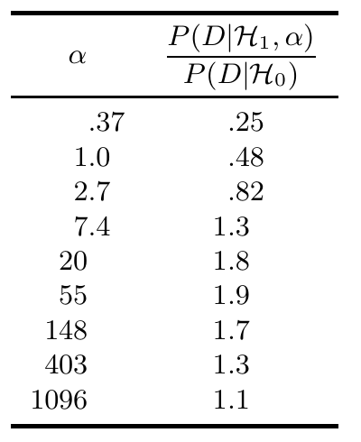
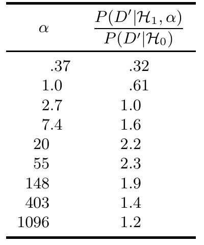

这个比值可以略微提高。图 3.11 列出了若干 $\alpha$ 值对应的结果。即使选择最有利的 $\alpha$（$\alpha\simeq50$），支持 $\mathcal H_1$ 的似然比也只能达到约二比一。

图 3.11　先验分布取不同超参数 $\alpha$ 时的似然比 $P(D\mid\mathcal H_1,\alpha)/P(D\mid\mathcal H_0)$。图内各行依次为：$\alpha=0.37,1.0,2.7,7.4,20,55,148,403,1096$；相应的比值为 $0.25,0.48,0.82,1.3,1.8,1.9,1.7,1.3,1.1$。

总之，这些数据并不“非常可疑”。最多只能把它们解释为以约二比一的程度，支持两个假设中的一个。

> 这些并不显著的似然比，是因为先验限制太多吗？有没有办法得出“非常可疑”的结论？从似然角度看，最符合数据的先验，是把 $p$ 以概率 $1$ 固定为 $f\equiv140/250$。称这个模型为 $\mathcal H_*$。它的似然比为 $P(D\mid\mathcal H_*)/P(D\mid\mathcal H_0)=2^{250}f^{140}(1-f)^{110}=6.1$。所以，针对“硬币没有偏向”这一假设，这些数据所能给出的最强证据不过约为六比一。

既然已经看到“抽样理论”统计方法可能得出多么荒谬、具有误导性的答案——比如刚解的那道题给出的 $7\%$ 的 $p$ 值——不妨再进一步指出问题。把数据稍作改动：250 次抛掷中正面次数由 140 增加到 141，$p$ 值便降到貌似神奇的 $0.05$ 以下（具体是 $0.0497$）。采用抽样理论的统计学家会高兴地喊：“得到至少像 141 次正面这样极端的结果，其概率小于 $0.05$——因此我们在 $5\%$ 显著性水平上拒绝零假设。”对于不同的 $\alpha$，正确答案列于图 3.12。表中值得强调的值有两个。第一，$\mathcal H_1$ 采用标准均匀先验时，似然比为 $1:0.61$，支持零假设 $\mathcal H_0$。第二，从 $\mathcal H_1$ 的角度选取最有利的 $\alpha$，也只能得到约 $2.3:1$ 的似然比来支持 $\mathcal H_1$。

图 3.12　250 次试验中观察到 $D'=141$ 次正面时，先验分布取不同超参数 $\alpha$ 所对应的似然比 $P(D'\mid\mathcal H_1,\alpha)/P(D'\mid\mathcal H_0)$。图内各行依次为：$\alpha=0.37,1.0,2.7,7.4,20,55,148,403,1096$；相应的比值为 $0.32,0.61,1.0,1.6,2.2,2.3,1.9,1.4,1.2$。

请注意！人们常把 $0.05$ 的 $p$ 值理解为，反对零假设的赔率约为二十比一。但在这个例子里，真实的证据可能略微支持零假设；即便反对它，最多也不过是 $2.3:1$。结论取决于先验的选择。

传统统计学中的 $p$ 值和“显著性水平”都应极其谨慎地对待。离它们远点！讲道到此结束。
