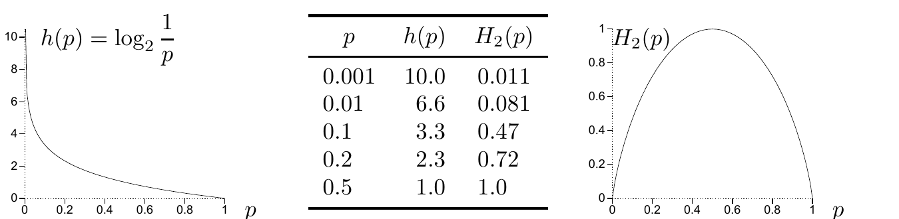

<!-- 源 PDF 物理页 079；原书印刷页 67 -->

# 第 4 章　信源编码定理

> **编者导读（非原书正文）**　本章从一次结果所提供的信息量出发，解释熵与数据压缩之间的联系。称球、猜数字、潜艇游戏和虚构语言提供了直观例子；随后用典型集与大数定律证明信源编码定理。

## 4.1 如何度量随机变量的信息量？

在接下来的几章里，我们会讨论概率分布和随机变量。多数时候，略显宽松的记号已足够；但偶尔也需要精确的记号。下面沿用第 2 章确立的记法。

**系综（ensemble）** $X$ 是一个三元组 $(x,\mathcal A_X,\mathcal P_X)$：结果 $x$ 是随机变量的取值，它从可能取值的集合 $\mathcal A_X=\{a_1,a_2,\ldots,a_i,\ldots,a_I\}$ 中取值；相应的概率为 $\mathcal P_X=\{p_1,p_2,\ldots,p_I\}$，其中 $P(x=a_i)=p_i$、$p_i\geq0$，且 $\sum_{a_i\in\mathcal A_X}P(x=a_i)=1$。

如何度量这一系综中结果 $x=a_i$ 所包含的信息量？本章考察以下两个论断：

1. **香农信息量（Shannon information content）**

   $$h(x=a_i)\equiv\log_2\frac{1}{p_i}\tag{4.1}$$

   是度量结果 $x=a_i$ 信息量的合理方式。
2. 系综的**熵（entropy）**

   $$H(X)=\sum_i p_i\log_2\frac{1}{p_i}\tag{4.2}$$

   是度量系综平均信息量的合理方式。

图 4.1　香农信息量 $h(p)=\log_2(1/p)$ 和二元熵函数 $H_2(p)=H(p,1-p)=p\log_2(1/p)+(1-p)\log_2[1/(1-p)]$ 随 $p$ 变化。图中两条曲线分别标作 $h(p)$ 和 $H_2(p)$，横轴均为 $p$；中间表格的三列为 $p$、$h(p)$、$H_2(p)$，数据依次为 $(0.001,10.0,0.011)$、$(0.01,6.6,0.081)$、$(0.1,3.3,0.47)$、$(0.2,2.3,0.72)$、$(0.5,1.0,1.0)$。

图 4.1 给出了概率为 $p$ 的结果的香农信息量随 $p$ 变化的情况。一个结果越不可能发生，它的香农信息量就越大。图中还给出了二元熵函数

$$H_2(p)=H(p,1-p)=p\log_2\frac1p+(1-p)\log_2\frac1{1-p},\tag{4.3}$$

它是字母表 $\mathcal A_X=\{a,b\}$、概率分布 $\mathcal P_X=\{p,1-p\}$ 的系综 $X$ 的熵。
