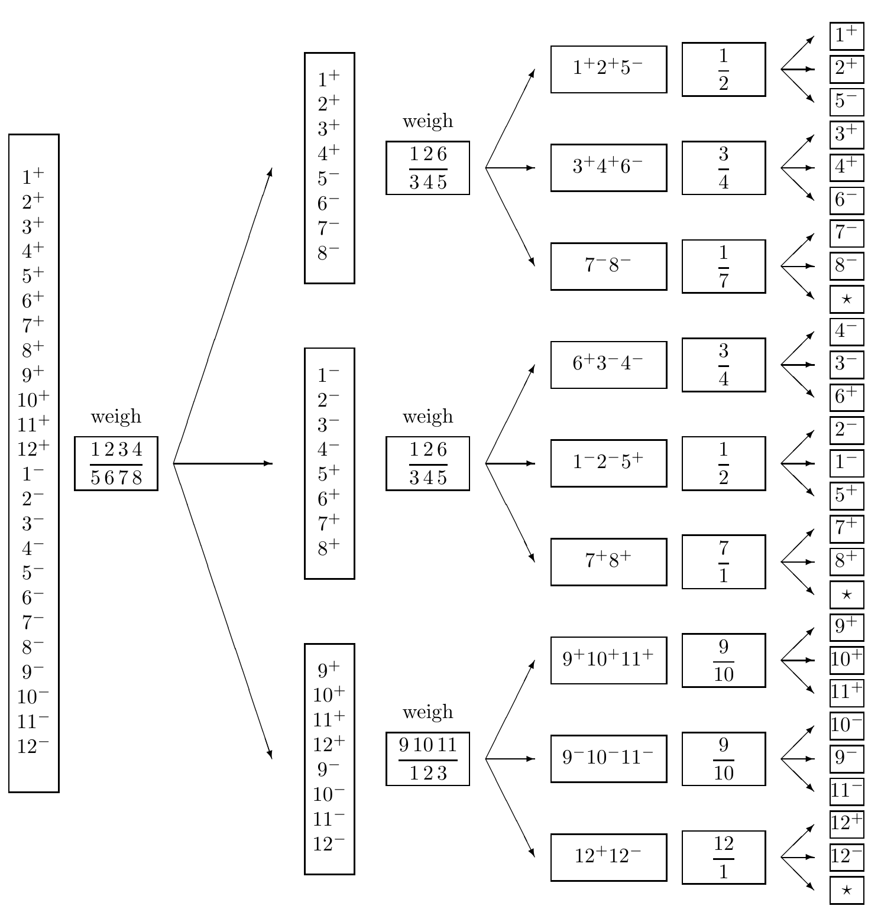

<!-- 源 PDF 物理页 081；原书印刷页 69 -->

图 4.2　称球问题的一种最优解。每一步有两个框：左框列出仍可能成立的假设，右框列出下一次称量所用的球。24 个假设记为 $1^+,\ldots,12^-$；例如 $1^+$ 表示 1 号球是异重球且偏重。称量时，把左右两盘的球号分别写在横线两侧。例如第一次称量，左盘放 1、2、3、4 号球，右盘放 5、6、7、8 号球。每组三支箭头中，上方表示左盘较重，中间表示右盘较重，下方表示平衡。标有星号的三个终点对应不可能出现的结果。图内英文 *weigh* 意为“称量”。
