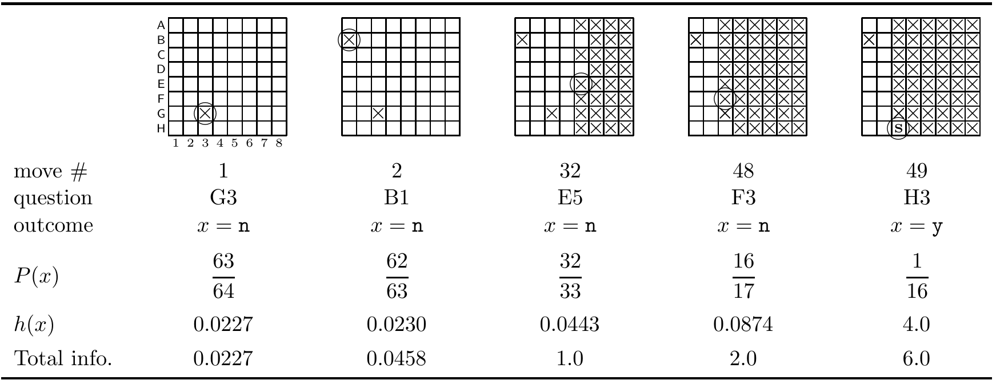

<!-- 源 PDF 物理页 083；原书印刷页 71 -->

图 4.3　潜艇游戏：第 49 次射击击中潜艇。图中行标 A–H、列标 1–8 是方格坐标；圆圈表示本次射击方格，叉号表示已经射空的方格，S 表示潜艇。图下表格的行依次为“行动次数”“所问方格”“结果”“结果概率 $P(x)$”“信息量 $h(x)$”“累计信息量”；第 1、2、32、48、49 次对应的方格依次为 G3、B1、E5、F3、H3，结果依次为未中、未中、未中、未中、命中；概率依次为 $63/64$、$62/63$、$32/33$、$16/17$、$1/16$，信息量依次为 $0.0227$、$0.0230$、$0.0443$、$0.0874$、$4.0$ 比特，累计信息量依次为 $0.0227$、$0.0458$、$1.0$、$2.0$、$6.0$ 比特。图内 $x=n$ 表示未中，$x=y$ 表示命中；*move #*、*question*、*outcome*、*Total info.* 分别为“行动次数”“所问方格”“结果”“累计信息量”。

### 潜艇游戏：一个比特如何传递多个比特？

在战舰游戏中，每名玩家把一支舰队藏在以方格表示的海域里。每一回合，一名玩家向对方海域中的一个方格开火，试图击中对方的舰船。对于所选方格（如 G3），得到的答复可能是“未中”“命中”或“命中并击沉”。

在一个比较乏味、名为“潜艇”的战舰游戏版本中，每名玩家只把一艘潜艇藏在一个 $8\times8$ 方格棋盘的某一格里。图 4.3 展示了游戏过程中的几个画面：圆圈表示正在开火的方格，叉号表示射击结果为未中的方格（$x=n$）；第 49 次射击击中了潜艇（结果 $x=y$，用符号 S 表示）。

玩家每次射击都定义了一个系综。两种可能结果为 $\{y,n\}$，分别表示命中与未中；概率取决于当时棋盘上的情况。开始时，$P(y)=1/64$、$P(n)=63/64$。如果第一次未中，第二次射击时 $P(y)=1/63$、$P(n)=62/63$。如果前两次均未中，第三次时 $P(y)=1/62$、$P(n)=61/62$。

结果 $x$ 带来的香农信息量为 $h(x)=\log[1/P(x)]$。如果运气很好，第一发就击中潜艇，则

$$h(x)=h_{(1)}(y)=\log_2 64=6\text{ 比特。}\tag{4.8}$$

一个二元结果竟能传递 6 比特，初看也许有点奇怪。但我们已经知道潜艇藏在哪里，而它原本可能位于 64 个方格中的任意一个；所以，这个碰巧问中的二元问题的确让我们得到了 6 比特信息。

如果第一发未中呢？从这一结果获得的香农信息量为

$$h(x)=h_{(1)}(n)=\log_2\frac{64}{63}=0.0227\text{ 比特。}\tag{4.9}$$

这合理吗？现在还不太明显。继续来看。如果第二发也未中，第二个结果的香农信息量为

$$h_{(2)}(n)=\log_2\frac{63}{62}=0.0230\text{ 比特。}\tag{4.10}$$

如果我们连续 32 次未中（每次射向一个新方格），则获得的香农信息总量为

$$\begin{aligned}\log_2\frac{64}{63}+\log_2\frac{63}{62}+\cdots+\log_2\frac{33}{32}
&=0.0227+0.0230+\cdots+0.0430\\
&=1.0\text{ 比特。}\end{aligned}\tag{4.11}$$
