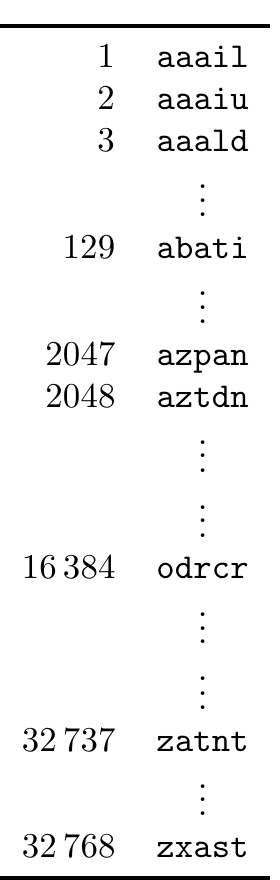

<!-- 源 PDF 物理页 084；原书印刷页 72 -->

为什么恰好是这个整数？想想我们学到了什么：现在知道潜艇不在已射击的 32 个方格中。这就像玩“六十三”游戏（原书印刷页 70），第一个问题问“$x$ 是否属于我射击的这些方格所对应的 32 个数？”，得到“否”的回答。这个回答排除了一半假设，因此给出 1 比特信息。

48 次射击均未命中后，获得的信息量是 2 比特：潜艇位置已经缩小到原先假设空间的四分之一。

如果第 49 次射击击中潜艇，而射击前还剩 16 个可能方格呢？这一结果的香农信息量为

$$h_{(49)}(y)=\log_2 16=4.0\text{ 比特。}\tag{4.12}$$

所有这些结果的香农信息量之和为

$$\begin{aligned}\log_2\frac{64}{63}+\log_2\frac{63}{62}+\cdots+\log_2\frac{17}{16}+\log_2\frac{16}{1}
&=0.0227+0.0230+\cdots+0.0874+4.0\\
&=6.0\text{ 比特。}\end{aligned}\tag{4.13}$$

因此，一旦知道潜艇的位置，获得的香农信息总量就是 6 比特。

无论在哪一次射击中击中潜艇，这一结果都成立。假设命中前还剩 $n$ 个可选方格——在式 (4.13) 中 $n=16$——则获得的信息总量为

$$\begin{aligned}
\log_2\frac{64}{63}+\log_2\frac{63}{62}+\cdots+\log_2\frac{n+1}{n}+\log_2\frac n1
&=\log_2\left[\frac{64}{63}\times\frac{63}{62}\times\cdots\times\frac{n+1}{n}\times\frac n1\right]\\
&=\log_2\frac{64}{1}=6\text{ 比特。}
\end{aligned}\tag{4.14}$$

到此为止，我们从这些例子中学到了什么？我认为，潜艇例子相当有说服力地表明，香农信息量是合理的信息量度量。“六十三”游戏还表明，香农信息量与编码随机实验结果的文件大小可能紧密相关，因而暗示它与数据压缩可能存在联系。

如果你还不相信，我们再看一个例子。

### Wenglish 语言

Wenglish 是一种类似英语的语言。Wenglish 的句子由从 Wenglish 词典中随机抽取的单词组成。词典有 $2^{15}=32{,}768$ 个词，每个词长 5 个字符。词典中的每个词都是按图 2.1 所示的 a 到 z 字母概率分布，随机选取五个字母构造的。

图 4.4　Wenglish 词典。图示条目依次为 1 aaail、2 aaaiu、3 aaald、129 abati、2047 azpan、2048 aztdn、16384 odrcr、32737 zatnt、32768 zxast；省略号表示未列出的词。

图 4.4 按字母顺序列出词典中的部分条目。注意，词典里的词数 $32{,}768$ 远小于所有可能的五字母词的总数，后者为 $26^5\simeq12{,}000{,}000$。

由于字母 z 的概率约为 $1/1000$，词典中只有 32 个词以 z 开头。相比之下，字母 a 的概率约为 $0.0625$，有 2048 个词以 a 开头。在这 2048 个词中，有两个以 az 开头，128 个以 aa 开头。

设想我们正在阅读一份 Wenglish 文档，讨论获取各字符时它们的香农信息量。如果我们
