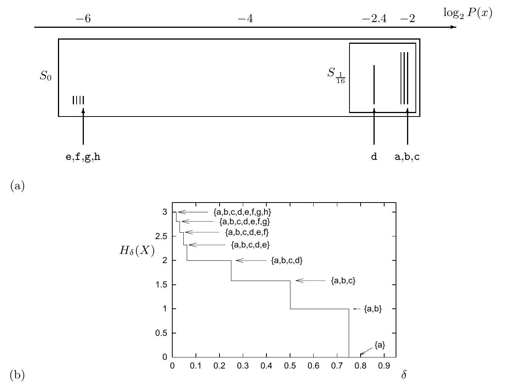

<!-- 源 PDF 物理页 088；原书印刷页 76 -->

图 4.6　(a) 例 4.6（原书印刷页 75）中系综 $X$ 的结果，按概率排序；横轴为 $\log_2P(x)$。图中从低到高的概率组为 $\{e,f,g,h\}$、$\{d\}$、$\{a,b,c\}$；框出了 $S_0$ 和 $S_{1/16}$。(b) 必要比特量 $H_\delta(X)$ 随 $\delta$ 变化的阶梯图。标注的集合为相应 $\delta$ 下的最小充分集，依次包括 $\{a\}$、$\{a,b\}$、$\{a,b,c\}$、$\{a,b,c,d\}$，直至 $\{a,b,c,d,e,f,g,h\}$。特别地，$H_0(X)=3$ 比特，$H_{1/16}(X)=2$ 比特。

### 扩展系综

如果把信源发出的符号分成块来压缩，这种方法会更有用吗？

现在考察一类例子：结果 $\mathbf x=(x_1,x_2,\ldots,x_N)$ 是来自单一系综 $X$ 的 $N$ 个独立同分布随机变量构成的序列。记 $X^N$ 为系综 $(X_1,X_2,\ldots,X_N)$。请记住，对独立变量，熵具有可加性（习题 4.2，原书印刷页 68），所以 $H(X^N)=NH(X)$。

**例 4.7。** 考虑将一枚不均匀的硬币抛 $N$ 次所得的序列 $\mathbf x=(x_1,x_2,\ldots,x_N)$，其中 $x_n\in\{0,1\}$，概率为 $p_0=0.9$、$p_1=0.1$。最可能的序列是含 $0$ 最多的序列。若 $r(\mathbf x)$ 是 $\mathbf x$ 中 $1$ 的个数，则

$$P(\mathbf x)=p_0^{N-r(\mathbf x)}p_1^{r(\mathbf x)}.\tag{4.20}$$

要计算 $H_\delta(X^N)$，须找出最小充分子集 $S_\delta$。该子集包含所有 $r(\mathbf x)=0,1,2,\ldots,r_{\max}(\delta)-1$ 的 $\mathbf x$，以及一部分 $r(\mathbf x)=r_{\max}(\delta)$ 的 $\mathbf x$。图 4.7 和图 4.8 分别画出 $N=4$ 和 $N=10$ 时 $H_\delta(X^N)$ 随 $\delta$ 的变化。每一级台阶是 $|S_\delta|$ 变化 1 的位置；阶梯斜率改变所形成的尖点，对应 $r_{\max}$ 变化 1 的位置。

**习题 4.8**〔难度 2；解答见原书印刷页 86〕尖点之间的曲线是什么数学形状？

在图 4.6–4.8 的例子中，$H_\delta(X^N)$ 强烈依赖于 $\delta$，所以它似乎不是一种基本或有用的信息量定义。不过，现在考察 $X^N$ 中独立变量的个数 $N$ 增大时会发生什么。我们将得到一个引人注目的结论：$H_\delta(X^N)$ 会变得几乎与 $\delta$ 无关，而且对于所有 $\delta$，它都非常接近 $NH(X)$，其中 $H(X)$ 是其中一个随机变量的熵。

图 4.9 以例 4.7 的二元系综说明这种渐近趋势。随着 $N$ 增大，$N^{-1}H_\delta(X^N)$ 随 $\delta$ 变化的曲线越来越平坦，
