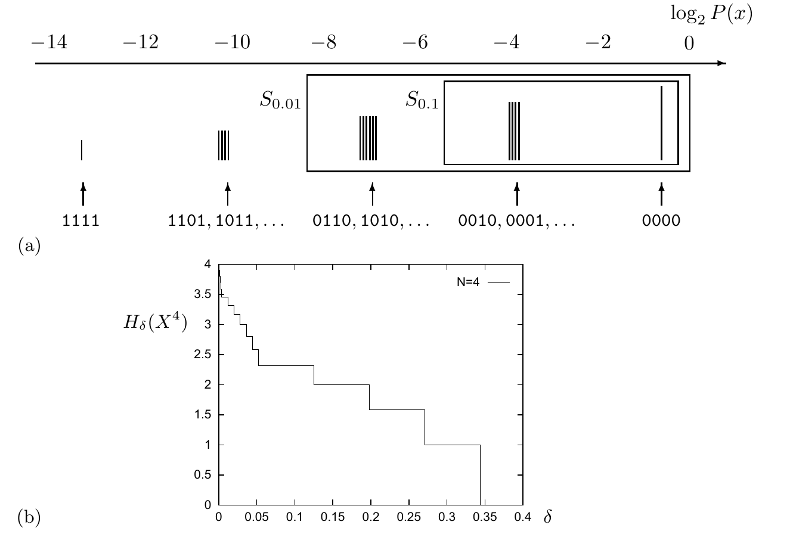
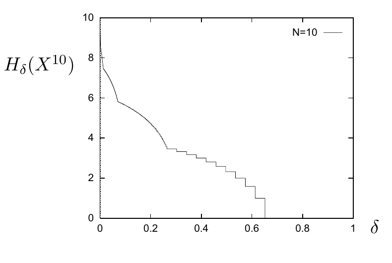
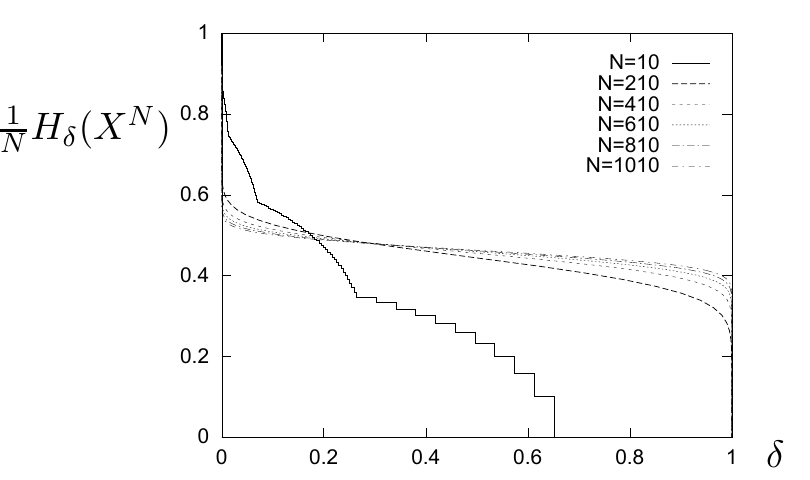

<!-- 源 PDF 物理页 089；原书印刷页 77 -->

图 4.7　(a) $p_1=0.1$ 时系综 $X^4$ 的 16 个结果，按概率排列。上方示意图用竖线长度表示各序列的概率，未按比例绘制；横轴为 $\log_2P(\mathbf x)$。序列例子从左到右包括 $1111$、$1101,1011,\ldots$、$0110,1010,\ldots$、$0010,0001,\ldots$、$0000$，并标出 $S_{0.01}$ 与 $S_{0.1}$。(b) 必要比特量 $H_\delta(X^4)$ 随横轴 $\delta$ 变化的阶梯图。

图 4.8　$p_1=0.1$、$N=10$ 个二元变量时的 $H_\delta(X^N)$；横轴为 $\delta$，纵轴为 $H_\delta(X^{10})$。

图 4.9　$p_1=0.1$ 时，$N=10,210,\ldots,1010$ 个二元变量的 $N^{-1}H_\delta(X^N)$。横轴为 $\delta$，纵轴为 $N^{-1}H_\delta(X^N)$；图例分别标出 $N=10,210,410,610,810,1010$。
