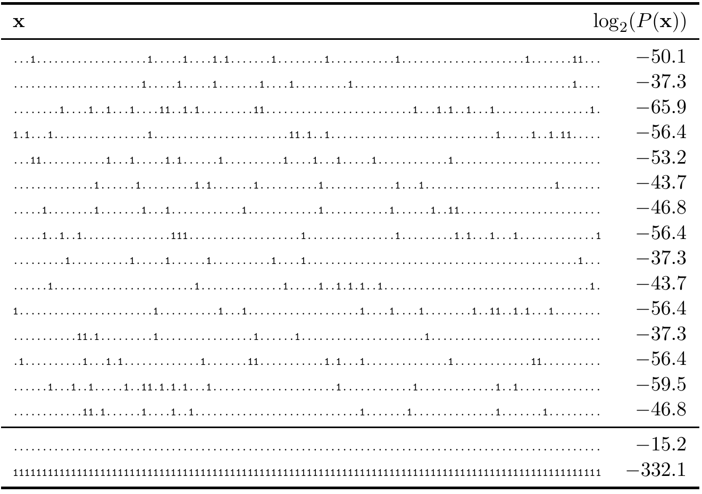

<!-- 源 PDF 物理页 090；原书印刷页 78 -->

图 4.10　上方 15 行是来自 $X^{100}$ 的样本，$p_1=0.1$、$p_0=0.9$；下方两行是此系综中概率最高和最低的序列。左列 $\mathbf x$ 中每个点表示 $0$，数字 $1$ 表示 $1$；右列 $\log_2P(\mathbf x)$ 是各序列的对数概率，可与熵 $H(X^{100})=46.9$ 比特比较。样本的右列数值依次为 $-50.1,-37.3,-65.9,-56.4,-53.2,-43.7,-46.8,-56.4,-37.3,-43.7,-56.4,-37.3,-56.4,-59.5,-46.8$；最可能与最不可能序列分别为 $-15.2$ 和 $-332.1$。

但靠近 $\delta=0$ 和 $1$ 的尾部除外。只要容许极小的错误概率 $\delta$，就能压缩到 $NH$ 比特。即使容许很大的错误概率，仍然只能压缩到 $NH$ 比特。这就是**信源编码定理**。

**定理 4.1　香农信源编码定理。** 设 $X$ 是熵为 $H(X)=H$ 比特的系综。对于任意 $\epsilon>0$ 和 $0<\delta<1$，存在正整数 $N_0$，使得当 $N>N_0$ 时，

$$\left|\frac1N H_\delta(X^N)-H\right|<\epsilon.\tag{4.21}$$

## 4.4 典型性

为什么增大 $N$ 会有帮助？来考察从 $X^N$ 得到的长序列。表 4.10（原书如此称呼，版面图注编号为“图 4.10”）给出了 $N=100$、$p_1=0.1$ 时 $X^N$ 的 15 个样本。一个含有 $r$ 个 $1$、$N-r$ 个 $0$ 的序列 $\mathbf x$，其概率为

$$P(\mathbf x)=p_1^r(1-p_1)^{N-r}.\tag{4.22}$$

含有 $r$ 个 $1$ 的序列个数为

$$n(r)=\binom Nr.\tag{4.23}$$

因此，$1$ 的个数 $r$ 服从二项分布：

$$P(r)=\binom Nr p_1^r(1-p_1)^{N-r}.\tag{4.24}$$

图 4.11 展示了这些函数。$r$ 的均值为 $Np_1$，标准差为 $\sqrt{Np_1(1-p_1)}$（原书印刷页 1）。如果 $N=100$，则

$$r\sim Np_1\pm\sqrt{Np_1(1-p_1)}\simeq10\pm3.\tag{4.25}$$
