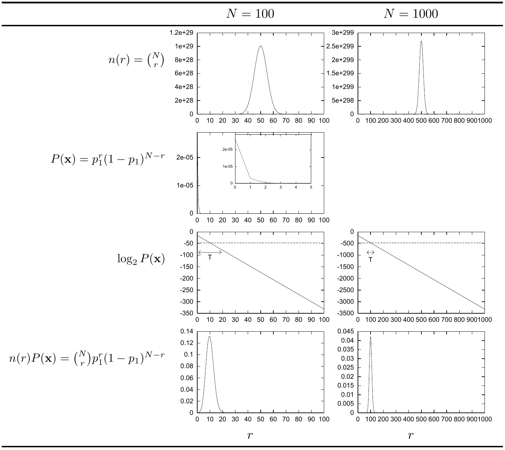

<!-- 源 PDF 物理页 091；原书印刷页 79 -->

图 4.11　典型集 $T$ 的构成。取 $p_1=0.1$，分别令 $N=100$（左列）和 $N=1000$（右列）。四行图自上而下分别表示：含 $r$ 个 $1$ 的序列数 $n(r)=\binom Nr$；每个此类序列的概率 $P(\mathbf x)$；这一概率的对数 $\log_2P(\mathbf x)$；含 $r$ 个 $1$ 的全部序列的总概率 $n(r)P(\mathbf x)$。横轴均为 $r$。对数概率图中的虚线为 $\log_2P(\mathbf x)$ 的均值 $-NH_2(p_1)$，当 $N=100$ 时为 $-46.9$，当 $N=1000$ 时为 $-469$。典型集只收录 $\log_2P(\mathbf x)$ 接近此值的序列。标记为 $T$ 的范围表示第 4.4 节定义的 $T_{N\beta}$：左列 $N=100,\beta=0.29$；右列 $N=1000,\beta=0.09$。
