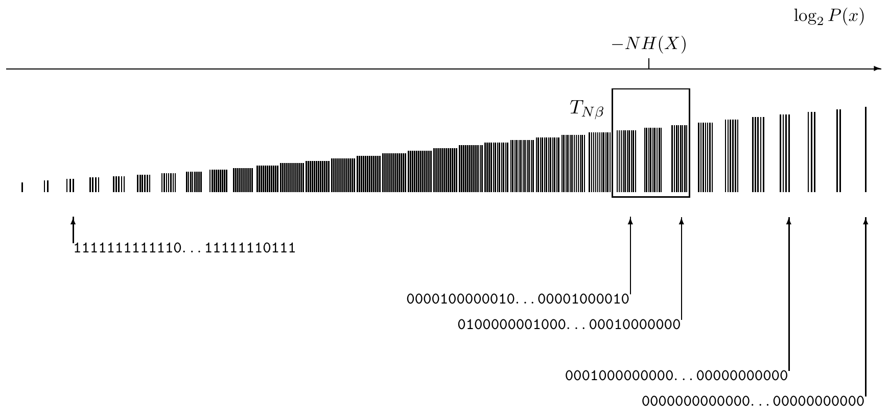

<!-- 源 PDF 物理页 093；原书印刷页 81 -->

图 4.12　系综 $X^N$ 中所有序列按概率排序的示意图，并标出典型集 $T_{N\beta}$。横轴是 $\log_2P(\mathbf x)$，标线为 $-NH(X)$；下方的二进制串示例从左端大量 $1$ 的串过渡到右端大量 $0$ 的串。

“渐近均分”原理等价于：

**香农信源编码定理（文字表述）。** 当 $N\to\infty$ 时，$N$ 个独立同分布随机变量每个的熵为 $H(X)$，可以把它们压缩为略多于 $NH(X)$ 比特，丢失信息的风险可忽略不计；反之，如果压缩到少于 $NH(X)$ 比特，就几乎肯定会丢失信息。

两个定理等价，因为可以定义一种压缩算法，为典型集中的每个 $\mathbf x$ 分配一个各不相同、长度为 $NH(X)$ 比特的名字。

## 4.5 证明

如果觉得这一节困难，可以跳过。

### 大数定律

我们对信源编码定理的证明使用大数定律。

**实随机变量的均值和方差**为 $\mathbb E[u]=\bar u=\sum_uP(u)u$，以及 $\operatorname{var}(u)=\sigma_u^2=\mathbb E[(u-\bar u)^2]=\sum_uP(u)(u-\bar u)^2$。

> **技术说明。** 严格说来，这里假设 $u$ 是有限离散系综 $X$ 中样本 $x$ 的函数 $u(x)$。因此，求和 $\sum_uP(u)f(u)$ 应写成 $\sum_xP(x)f(u(x))$。这意味着 $P(u)$ 是有限个 $\delta$ 函数之和。这个限制保证 $u$ 的均值与方差存在；对一般的 $P(u)$ 则未必如此。

**切比雪夫不等式 1。** 设 $t$ 为非负实随机变量，$\alpha$ 为正实数。那么

$$P(t\geq\alpha)\leq\frac{\bar t}{\alpha}.\tag{4.30}$$

**证明。** $P(t\geq\alpha)=\sum_{t\geq\alpha}P(t)$。将每项乘以 $t/\alpha\geq1$，得到 $P(t\geq\alpha)\leq\sum_{t\geq\alpha}P(t)t/\alpha$。再把缺少的非负项加上，便有 $P(t\geq\alpha)\leq\sum_tP(t)t/\alpha=\bar t/\alpha$。□
