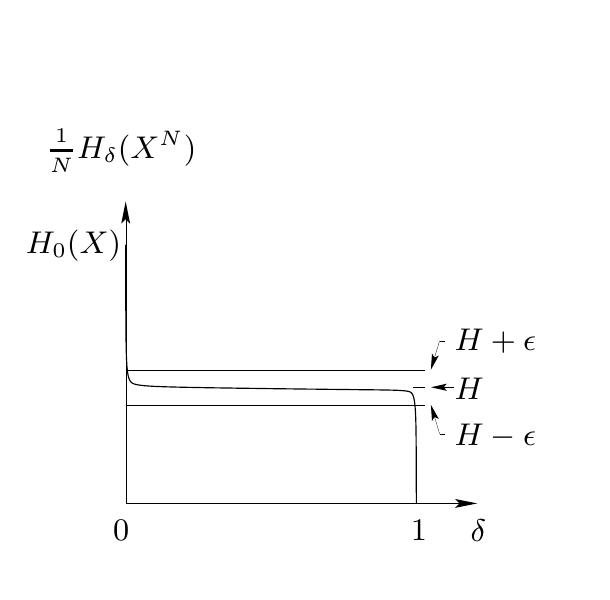

<!-- 源 PDF 物理页 094；原书印刷页 82 -->

**切比雪夫不等式 2。** 设 $x$ 为随机变量，$\alpha$ 为正实数。那么

$$P\bigl((x-\bar x)^2\geq\alpha\bigr)\leq\frac{\sigma_x^2}{\alpha}.\tag{4.31}$$

**证明。** 令 $t=(x-\bar x)^2$，应用上一命题。□

**弱大数定律。** 设 $x$ 是 $N$ 个独立随机变量 $h_1,\ldots,h_N$ 的平均值，这些变量具有共同的均值 $\bar h$ 和共同的方差 $\sigma_h^2$：$x=N^{-1}\sum_{n=1}^Nh_n$。那么

$$P\bigl((x-\bar h)^2\geq\alpha\bigr)\leq\frac{\sigma_h^2}{\alpha N}.\tag{4.32}$$

**证明。** 只需证明 $\bar x=\bar h$、$\sigma_x^2=\sigma_h^2/N$。□

我们希望 $x$ 非常接近均值（即 $\alpha$ 很小）。无论 $\sigma_h^2$ 多大、所需的 $\alpha$ 多小，或者希望事件 $(x-\bar h)^2\geq\alpha$ 的概率多小，都可通过取足够大的 $N$ 实现。

### 定理 4.1（原书印刷页 78）的证明

对从系综 $X^N$ 抽出的 $\mathbf x$，将大数定律用于随机变量 $N^{-1}\log_2[1/P(\mathbf x)]$。它可写成 $N$ 个信息量 $h_n=\log_2[1/P(x_n)]$ 的平均值；每个 $h_n$ 都是均值 $H=H(X)$、方差 $\sigma^2\equiv\operatorname{var}\{\log_2[1/P(x_n)]\}$ 的随机变量。（每个 $h_n$ 都是第 $n$ 次结果的香农信息量。）

再次用参数 $N$ 和 $\beta$ 定义典型集：

$$T_{N\beta}=\left\{\mathbf x\in\mathcal A_X^N:\left[\frac1N\log_2\frac1{P(\mathbf x)}-H\right]^2<\beta^2\right\}.\tag{4.33}$$

对所有 $\mathbf x\in T_{N\beta}$，其概率满足

$$2^{-N(H+\beta)}<P(\mathbf x)<2^{-N(H-\beta)}.\tag{4.34}$$

由大数定律，

$$P(\mathbf x\in T_{N\beta})\geq1-\frac{\sigma^2}{\beta^2N}.\tag{4.35}$$

这就证明了“渐近均分”原理。随着 $N$ 增大，对任意 $\beta$，$\mathbf x$ 落入 $T_{N\beta}$ 的概率趋近于 1。它与信源编码有什么关系？

我们必须把 $T_{N\beta}$ 与 $H_\delta(X^N)$ 联系起来。我们将证明，对任意给定的 $\delta$，存在足够大的 $N$，使 $H_\delta(X^N)\simeq NH$。

图 4.13　定理两部分的示意图。对任意给定的 $\delta$ 与 $\epsilon$，当 $N$ 足够大时，$N^{-1}H_\delta(X^N)$（纵轴）位于 $H+\epsilon$ 线的下方，以及 $H-\epsilon$ 线的上方；横轴为 $\delta$，并标出 $H_0(X)$ 与 $H$。

**第一部分：$N^{-1}H_\delta(X^N)<H+\epsilon$。**

集合 $T_{N\beta}$ 并非压缩时的最佳子集。因此，$T_{N\beta}$ 的大小给出 $H_\delta$ 的上界。我们通过计算 $T_{N\beta}$ 最多有多大，来说明 $H_\delta(X^N)$ 必须多小。可自由选择方便的 $\beta$。$T_{N\beta}$ 中每个成员的最小可能概率是 $2^{-N(H+\beta)}$，而集合的总概率不能大于 1，所以

$$|T_{N\beta}|2^{-N(H+\beta)}<1,\tag{4.36}$$

即典型集的大小满足上界

$$|T_{N\beta}|<2^{N(H+\beta)}.\tag{4.37}$$

令 $\beta=\epsilon$，再选择 $N_0$ 使 $\sigma^2/(\epsilon^2N_0)\leq\delta$，则 $P(T_{N\beta})\geq1-\delta$。于是 $T_{N\beta}$ 就证明了 $H_\delta(X^N)\leq\log_2|T_{N\beta}|<N(H+\epsilon)$。
