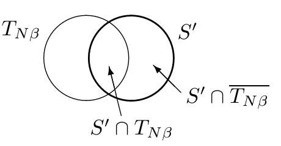

<!-- 源 PDF 物理页 095；原书印刷页 83 -->

**第二部分：$N^{-1}H_\delta(X^N)>H-\epsilon$。**

设想有人声称第二部分不成立，即对于任意 $N$，最小 $\delta$ 充分子集 $S_\delta$ 都比上述不等式允许的大小更小。可以用典型集证明这一说法必然有误。记住，我们可以自由选择 $\beta$。令 $\beta=\epsilon/2$，任务就变成证明：当 $N$ 大于某个稍后给出的 $N_0$ 时，不可能存在一个集合 $S'$，既有 $|S'|\leq2^{N(H-2\beta)}$，又有 $P(\mathbf x\in S')\geq1-\delta$。

现在考察落入这个竞争性的较小子集 $S'$ 的概率：

图内左圆为典型集 $T_{N\beta}$，右圆为较小的竞争子集 $S'$；重叠处标为 $S'\cap T_{N\beta}$，右圆在典型集外的部分标为 $S'\cap\overline{T_{N\beta}}$。

$$P(\mathbf x\in S')=P(\mathbf x\in S'\cap T_{N\beta})+P(\mathbf x\in S'\cap\overline{T_{N\beta}}),\tag{4.38}$$

其中 $\overline{T_{N\beta}}$ 是补集 $\{\mathbf x\notin T_{N\beta}\}$。若 $S'\cap T_{N\beta}$ 含有 $2^{N(H-2\beta)}$ 个结果，且每个结果都取最大概率 $2^{-N(H-\beta)}$，第一项便达到最大。第二项的最大值是 $P(\mathbf x\notin T_{N\beta})$。所以

$$P(\mathbf x\in S')\leq2^{N(H-2\beta)}2^{-N(H-\beta)}+\frac{\sigma^2}{\beta^2N}=2^{-N\beta}+\frac{\sigma^2}{\beta^2N}.\tag{4.39}$$

现在取 $\beta=\epsilon/2$，选择 $N_0$ 使 $P(\mathbf x\in S')<1-\delta$。这说明 $S'$ 不满足充分子集 $S_\delta$ 的定义。因此，任意满足 $|S'|\leq2^{N(H-\epsilon)}$ 的子集，其概率都小于 $1-\delta$；由 $H_\delta$ 的定义可知，$H_\delta(X^N)>N(H-\epsilon)$。

所以，当 $N$ 足够大时，对于 $0<\delta<1$，函数 $N^{-1}H_\delta(X^N)$ 基本上是 $\delta$ 的常数函数，见图 4.9 和图 4.13。□

## 4.6 评注

信源编码定理（原书印刷页 78）有两部分：$N^{-1}H_\delta(X^N)<H+\epsilon$，以及 $N^{-1}H_\delta(X^N)>H-\epsilon$。两个结论都很有意思。

第一部分告诉我们，即使错误概率 $\delta$ 极小，为了以几乎为零的错误概率指定一个长度为 $N$ 的序列 $\mathbf x$，每个符号所需的比特数 $N^{-1}H_\delta(X^N)$ 也不必超过 $H+\epsilon$。只要允许极小的错误，所需比特数便从 $H_0(X)$ 显著降至 $H+\epsilon$。

如果对压缩错误更加宽容，会发生什么？第二部分告诉我们，即使 $\delta$ 非常接近 1，因而大多数时候都会出错，指定 $\mathbf x$ 所需的每个符号的平均比特数仍至少为 $H-\epsilon$。这两个极端说明，不论具体允许多大错误，用于指定 $\mathbf x$ 的每符号比特数都是 $H$：不多也不少。

### 关于“渐近均分”的注意事项

我给“渐近均分”加上引号，是因为不能认为典型集 $T_{N\beta}$ 的元素实际上彼此具有大致相同的概率。它们的概率只是在这样的意义下相近：各自的 $\log_2[1/P(\mathbf x)]$ 相差不超过 $2N\beta$。现在，若减小 $\beta$，为了保持典型集概率下界 $P(\mathbf x\in T_{N\beta})\geq1-\sigma^2/(\beta^2N)$ 不变，$N$ 必须如何增大？$N$ 必须按 $1/\beta^2$ 增大。因此，若对某个常数 $\alpha$ 写成 $\beta=\alpha/\sqrt N$，那么
