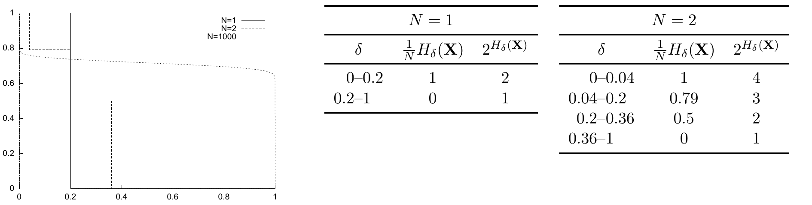

<!-- 源 PDF 物理页 099；原书印刷页 87 -->

第 1、2、3 次称量中，分别把下列球放到 A 盘和 B 盘：

| 称量 | A 盘 | B 盘 |
|:---:|:---|:---|
| 第 1 次 | AAB、ABA、ABB、ABC | BBC、BCA、BCB、BCC |
| 第 2 次 | AAB、CAA、CAB、CAC | ABA、ABB、ABC、BBC |
| 第 3 次 | ABA、BCA、CAA、CCA | AAB、ABB、BCB、CAB |

在任意一次称量中，天平的一个盘最后要么处于：

- 两盘平衡时它所在的**标准位置**（C）；
- 标准位置之上（A）；
- 标准位置之下（B）。

因此，三次称量会为每个盘确定一个由这三个字母组成的序列。如果两个盘的序列都是 CCC，那么没有异重球。否则，恰好有一个盘的序列属于前述 12 个序列；该序列指明异重球。若匹配的盘是 A 盘，则异重球偏重；若是 B 盘，则偏轻。

(b) 用同样方法，在 $W$ 次称量中，可从

$$N=\frac{3^W-3}{2}\tag{4.49}$$

个球里找出异重球。给这些球分别贴上长度为 $W$ 的 A、B、C 字母序列：序列不得所有字母相同，而且首次字母变化必须是 A 到 B、B 到 C 或 C 到 A。在第 $w$ 次称量中，把序列第 $w$ 个字母是 A 的球放在 A 盘，把该字母是 B 的球放在 B 盘。

**习题 4.15 的解答**（原书印刷页 85）。$N=1,2,1000$ 时，$N^{-1}H_\delta(X^N)$ 随 $\delta$ 变化的曲线见图 4.14。注意 $H_2(0.2)=0.72$ 比特。

图 4.14　纵轴为 $N^{-1}H_\delta(X^N)$，横轴为 $\delta$。图例标出 $N=1,2,1000$。原书图注写的是“$N=1,2,100$ 个二元变量、$p_1=0.4$”；此处照录其标注。图内另有 $N=1$ 与 $N=2$ 的两个数值表，译列如下：

| $N$ | $\delta$ 范围 | $N^{-1}H_\delta(X)$ | $2^{H_\delta(X)}$ |
|:---:|:---:|:---:|:---:|
| 1 | 0–0.2 | 1 | 2 |
| 1 | 0.2–1 | 0 | 1 |
| 2 | 0–0.04 | 1 | 4 |
| 2 | 0.04–0.2 | 0.79 | 3 |
| 2 | 0.2–0.36 | 0.5 | 2 |
| 2 | 0.36–1 | 0 | 1 |

**习题 4.17 的解答**（原书印刷页 85）。吉布斯熵为 $k_B\sum_i p_i\ln(1/p_i)$，其中 $i$ 遍历系统所有状态。除去因子 $k_B$，它等价于该系综的香农熵。

吉布斯熵可以对任意系综定义；玻尔兹曼熵则只对**微正则系综**定义，这种系综在可达状态集合上服从均匀概率分布。玻尔兹曼熵定义为 $S_B=k_B\ln\Omega$，其中 $\Omega$ 是微正则系综的可达状态数。除去因子 $k_B$，它等价于受此约束的系综的完整信息量 $H_0$。微正则系综的吉布斯熵显然等于玻尔兹曼熵。
