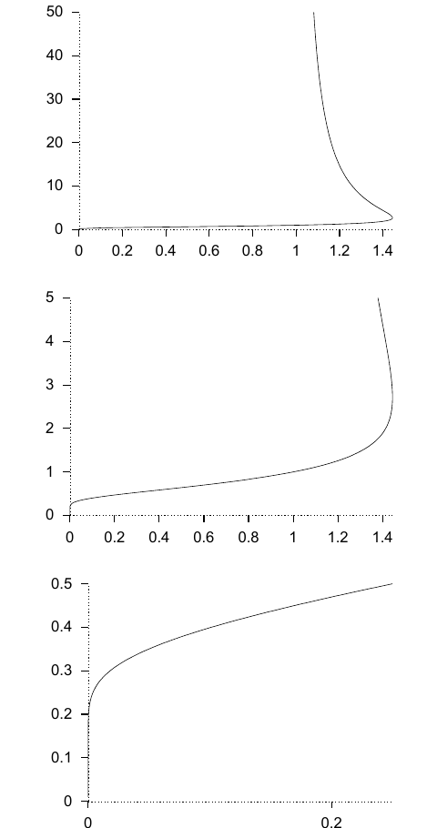

<!-- 源 PDF 物理页 101；原书印刷页 89 -->

**习题 4.20 的解答**（原书印刷页 86）。函数 $f(x)$ 的反函数为

$$g(y)=y^{1/y}.\tag{4.54}$$

注意

$$\log g(y)=\frac1y\log y.\tag{4.55}$$

我以 $y$ 为纵轴、$g(y)$ 为横轴画出 $g(y)$，由此得到 $f(x)$ 的一个暂定图像。该图像暗示：在 $x\in(0,1)$ 时，$f(x)$ 是单值的，而且出人意料地规整；在 $x\in(1,e^{1/e})$ 时，它有两个值。$f(\sqrt2)$ 可等于 2，也可等于 4。当 $x>e^{1/e}$（约 1.44）时，$f(x)$ 为无穷大。

不过，如果把 $f$ 定义为函数序列 $x,x^x,x^{x^x},\ldots$ 的极限，便可以说，上述作图方式只在一定程度上有效：由于 $x=(1/e)^e$ 处存在叉式分岔，这个序列在 $0\leq x\leq(1/e)^e\simeq0.07$ 时没有极限；而当 $x\in(1,e^{1/e})$ 时，序列的极限是单值的，取图中两个值中的较小值。

图 4.15　函数 $f(x)=x^{x^{x^{\cdots}}}$ 在三种不同尺度下的图像；各图横轴为 $x$，纵轴为 $f(x)$。
