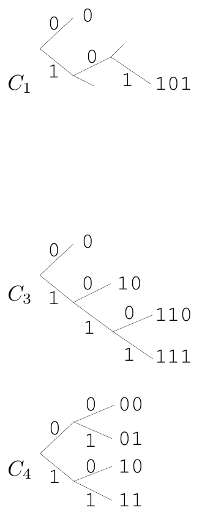

<!-- 源 PDF 物理页 105；原书印刷页 93 -->

**例 5.4。** $C_1=\{0,101\}$ 是前缀码，因为 $0$ 不是 $101$ 的前缀，$101$ 也不是 $0$ 的前缀。

**例 5.5。** 令 $C_2=\{1,101\}$。它不是前缀码，因为 $1$ 是 $101$ 的前缀。

**例 5.6。** $C_3=\{0,10,110,111\}$ 是前缀码。

**例 5.7。** $C_4=\{00,01,10,11\}$ 是前缀码。

图内三棵二叉树分别表示 $C_1,C_3,C_4$；每条分支旁的 $0$ 或 $1$ 是该分支的编码位，叶子旁标出完整码字。前缀码可以用二叉树表示。完整前缀码对应没有闲置分支的二叉树；$C_1$ 是不完整码。

**习题 5.8**〔难度 1；解答见原书印刷页 104〕$C_2$ 是唯一可译的吗？

**例 5.9。** 回顾习题 4.1（原书印刷页 66）和图 4.2（原书印刷页 69）。任何找出异重球并判断它偏重还是偏轻的称量策略，都可视为给 24 种可能状态各分配一个三元码。这个码是前缀码。

### 编码应尽可能压缩

系综 $X$ 的符号码 $C$ 的**期望码长** $L(C,X)$ 为

$$L(C,X)=\sum_{x\in\mathcal A_X}P(x)l(x).\tag{5.5}$$

也可以写成

$$L(C,X)=\sum_{i=1}^{I}p_i l_i,\tag{5.6}$$

其中 $I=|\mathcal A_X|$。

**例 5.10。** 设

$$\begin{aligned}\mathcal A_X&=\{a,b,c,d\},\\\mathcal P_X&=\{1/2,1/4,1/8,1/8\}.\end{aligned}\tag{5.7}$$

考虑码 $C_3$。$X$ 的熵为 1.75 比特，此码的期望码长 $L(C_3,X)$ 也是 1.75 比特。符号串 $\mathbf x=(\mathrm{acdbac})$ 编为 $c^+(\mathbf x)=0110111100110$。$C_3$ 是前缀码，因此唯一可译。注意，码长满足 $l_i=\log_2(1/p_i)$，等价地，$p_i=2^{-l_i}$。

| $C_3$ 的符号 $a_i$ | 码字 $c(a_i)$ | 概率 $p_i$ | 信息量 $h(p_i)$ | 码长 $l_i$ |
|:---:|:---:|:---:|:---:|:---:|
| a | 0 | $1/2$ | 1.0 | 1 |
| b | 10 | $1/4$ | 2.0 | 2 |
| c | 110 | $1/8$ | 3.0 | 3 |
| d | 111 | $1/8$ | 3.0 | 3 |

**例 5.11。** 对同一系综 $X$，考虑定长码 $C_4$。它的期望码长 $L(C_4,X)$ 是 2 比特。

| 符号 | $C_4$ | $C_5$ |
|:---:|:---:|:---:|
| a | 00 | 0 |
| b | 01 | 1 |
| c | 10 | 00 |
| d | 11 | 11 |

**例 5.12。** 考虑 $C_5$。其期望码长 $L(C_5,X)$ 是 1.25 比特，小于 $H(X)$。但这个码不是唯一可译的。序列 $\mathbf x=(\mathrm{acdbac})$ 编成 `000111000`，也可以解码为 $(\mathrm{cabdca})$。

**例 5.13。** 考虑 $C_6$。其期望码长 $L(C_6,X)$ 是 1.75 比特。序列 $\mathbf x=(\mathrm{acdbac})$ 编为 $c^+(\mathbf x)=0011111010011$。

| $C_6$ 的符号 $a_i$ | 码字 $c(a_i)$ | 概率 $p_i$ | 信息量 $h(p_i)$ | 码长 $l_i$ |
|:---:|:---:|:---:|:---:|:---:|
| a | 0 | $1/2$ | 1.0 | 1 |
| b | 01 | $1/4$ | 2.0 | 2 |
| c | 011 | $1/8$ | 3.0 | 3 |
| d | 111 | $1/8$ | 3.0 | 3 |

$C_6$ 是前缀码吗？不是，因为 $c(a)=0$ 是 $c(b)$ 和 $c(c)$ 的前缀。
