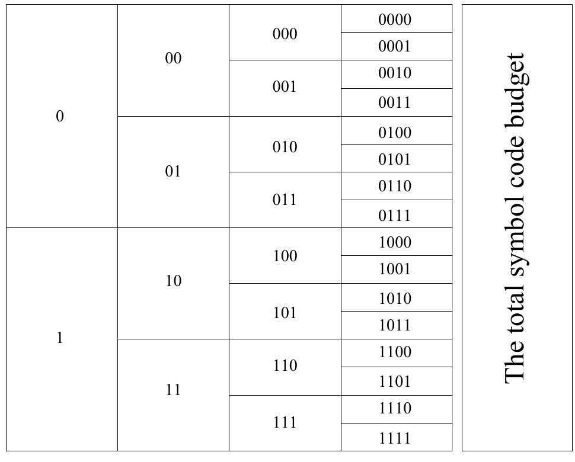
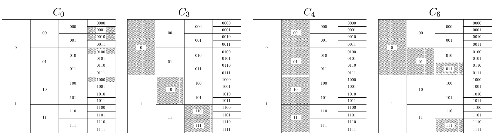

<!-- 源 PDF 物理页 108；原书印刷页 96 -->

图 5.1　符号编码的预算。每个长度为 $l$ 的码字的“价格”是 $2^{-l}$，用写有该码字的方框面积表示。构造唯一可译码时可用的总预算为 1。可以把此图想成一家“码字超市”：码字按长度陈列在不同货架上，每个码字的价格由其格子的大小表示。如果选定码字的价格总和超过预算，所得码便不是唯一可译的。图内竖排英文 *The total symbol code budget* 意为“符号码的总预算”。

图 5.2　第 5.1 节的码 $C_0,C_3,C_4,C_6$ 对码字的选择。每组上方为码名，阴影框显示已选码字；从左到右按长度列出候选二进制码字，空白格表示未选用。
