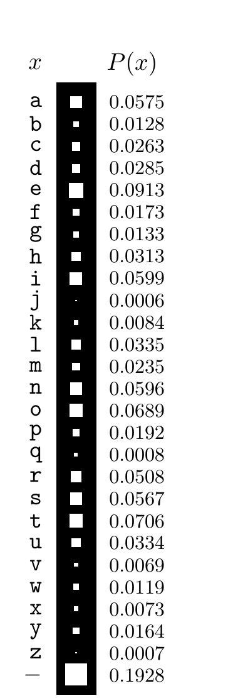

<!-- 源 PDF 物理页 110；原书印刷页 98 -->

## 5.4 能压缩多少？

我们不能压缩到熵以下。那么，能接近熵到什么程度？

**定理 5.1　符号码的信源编码定理。** 对系综 $X$，存在一个前缀码 $C$，使其期望码长满足

$$H(X)\leq L(C,X)<H(X)+1.\tag{5.19}$$

**证明。** 把码长设为略大于最优码长的整数：

$$l_i=\left\lceil\log_2\frac1{p_i}\right\rceil,\tag{5.20}$$

其中 $\lceil l^*\rceil$ 是大于或等于 $l^*$ 的最小整数。［这并不是说最优码一定采用这些码长；我们选择它们，只因为可用它们证明定理。］

先检验 Kraft 不等式成立，从而确认存在具有这些长度的前缀码：

$$\sum_i2^{-l_i}=\sum_i2^{-\lceil\log_2(1/p_i)\rceil}\leq\sum_i2^{-\log_2(1/p_i)}=\sum_i p_i=1.\tag{5.21}$$

再确认

$$L(C,X)=\sum_i p_i\left\lceil\log\frac1{p_i}\right\rceil<\sum_i p_i\left(\log\frac1{p_i}+1\right)=H(X)+1.\tag{5.22}$$

□

### 码长选错的代价

若所用码的长度不等于最优码长，平均消息长度就会大于熵。

若真实概率为 $\{p_i\}$，而采用码长为 $l_i$ 的完备码，则这些码长可视为定义了隐含概率 $q_i=2^{-l_i}$。接着式 (5.14)，平均长度为

$$L(C,X)=H(X)+\sum_i p_i\log\frac{p_i}{q_i},\tag{5.23}$$

即比熵多出相对熵 $D_{\mathrm{KL}}(\mathbf p\|\mathbf q)$（定义见原书印刷页 34）。

## 5.5 用符号码进行最优信源编码：Huffman 编码

给定一组概率 $\mathcal P$，如何设计最优前缀码？例如，图 5.3 中英语系综的最佳符号码是什么？这里说“最优”，是指使期望码长 $L(C,X)$ 最小。

图 5.3　一个需要符号码的系综。图内左列 $x$ 列出 a–z 和空格（用横线表示），右列 $P(x)$ 给出对应概率；方格面积表示概率大小。概率依次为 a 0.0575、b 0.0128、c 0.0263、d 0.0285、e 0.0913、f 0.0173、g 0.0133、h 0.0313、i 0.0599、j 0.0006、k 0.0084、l 0.0335、m 0.0235、n 0.0596、o 0.0689、p 0.0192、q 0.0008、r 0.0508、s 0.0567、t 0.0706、u 0.0334、v 0.0069、w 0.0119、x 0.0073、y 0.0164、z 0.0007、空格 0.1928。

### 不该怎样做

可以试着把集合 $\mathcal A_X$ 大致分成两半，再不断二分子集，从树根构造二叉树。这种做法的思路与称球问题相似，但未必最优；它达到的是 $L(C,X)\leq H(X)+2$。
